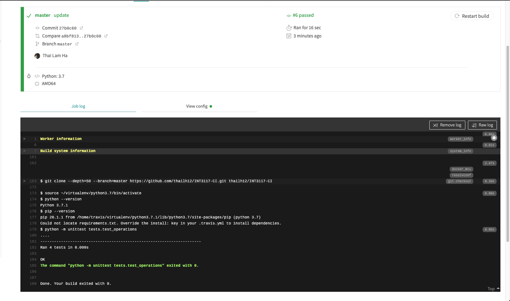

**Tạo dự án Github và cấu hình với Travis CI:**
- Github repository: [tại đây](https://github.com/thailh12/INT3117-CI) <br>
- Cấu hình ```.travis.yml```:
    ```yml
language: python
python:
 - "3.7"
script:
 - python -m unittest tests.test_operations

    ```

**Sau mỗi lần đẩy mã nguồn mới lên Github repository, Circle sẽ tự động khởi chạy lệnh ```python -m unittest tests.test_operations```<br>
 trên mã nguồn mới:**
 
 **ca kiểm thử thành công:**


**ca kiểm thử thất bại:**

