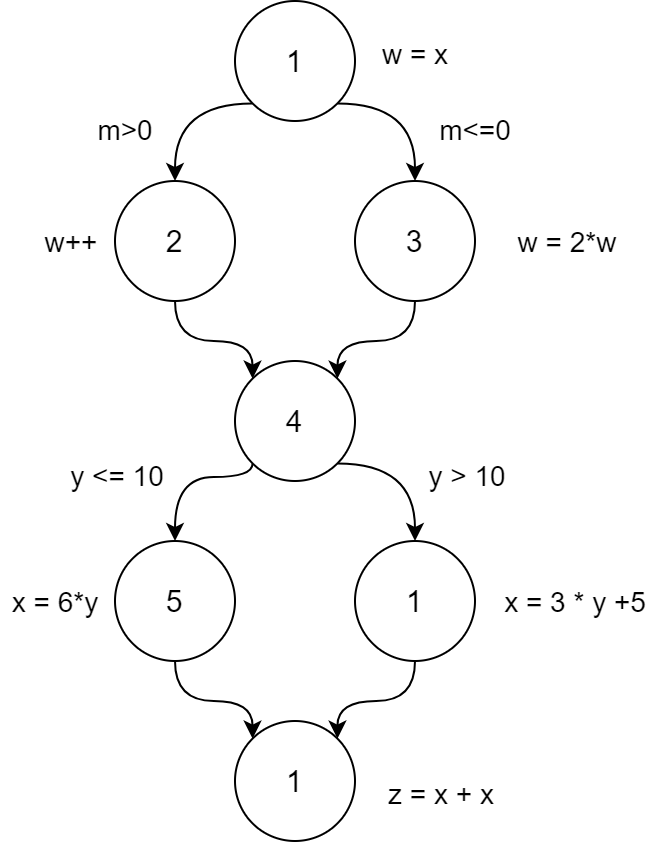

a. Vẽ đồ thị kiểm soát luồng điều kiến của bài sử dụng số nút cho sẵn

Sơ đồ luồng trong bài:

b. Nút nào có def cho biến `w`?
Nút `1,2,3` có defs cho `w`

c. Nút nào sử dụng cho biến `w`?
Nút `2,3,7` sử dụng cho `w`

d. Có đường đường dẫn `du` nào liên hệ với biến `w` từ nốt `1` đến nốt `7` không?
Nếu không, giải thích. Nếu có, chỉ ra một chú.
- Không có một đường dẫn def-clear nào từ nút `1` đến nút `7`
- Def của từ nút `2`và nút `3` đã khóa def trong nút 1.

e. Liệt kê tất cả các đường dẫn cho các biến `w` và `x`.

| STT | Đường dẫn | Biến |
|---------- | --- | --- | 
| `i` | `[1,2]` | `w` |
| `ii` | `[1,3]` | `w` | 
| `iii` | `[2,4,5,7]` | `w` | 
| `iv` | `[2,4,6,7]` | `w`| 
| `v` | `[3,4,5,7]` | `w` | 
| `vi` | `[3,4,6,7]` | `w` | 
| `vii` | `[5,7]` | `x` | 
| `viii` | `[6,7]` |`x`| 
