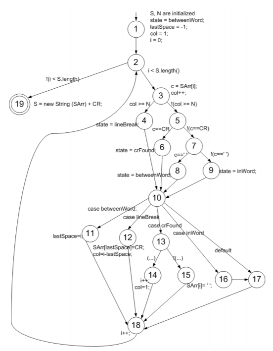

a. Vẽ sơ đồ luồng điều khiển cho phương thức `fmtRewrap()`:

 

b. Chỉ ra một ca kiểm thử thỏa mãn các đường dẫn kiểm thử đi qua các cạnh liên kết với điểm bắt đầu cho câu `while` đến `S = new String (SArr) + CR`:

- Có duy nhât một ca kiểm thử có thể thỏa mãn điều kiện "`S là một xâu rỗng`".
- Đường dẫn ca kiểm thử là `[1,2,19]`.

c. Liệt kê các yêu cầu kiểm bao phủ điểm, bao phủ cạnh và bao phủ đường dẫn quan trọng cho biểu đồ của `fmtRewrap()`.

- Bao phủ điểm: {`1`, `2`, `3`, `4`, `5`, `6`, `7`, `8`, `9`, `10`, `11`, `12`, `13`, `14`, `15`, `16`, `17`, `18`,
`19`}.
- Bao phủ cạnh: {`(1,2)`, `(2,3)`, `(2,19)`, `(3,4)`, `(3,5)`, `(4,10)`, `(5,6)`, `(5, 7)`,
`(6,10)`, `(7,8)`, `(7,9)`, `(8,10)`, `(9,10)`, `(10,11)`, `(10,12)`, `(10,13)`, `(10 , 16)`, `(10,17)`,
`(11,18)`, `(12,18)`,` (13,14)`, `(13,15)`, `(14,18)`, `(15,18)`, `(16,17)`, `(17,18)`, `(18,2)`}.

- Bao phủ đường dẫn quan trọng: Có 403 đường dẫn quan trọng cho `fmt`; ta có các cách kết cặp: 
  - Các đường dẫn quan trọng bắt đầu từ nút 2. 
  - Chúng nó có thể đi bất kỳ đường nào trong 4 đường đi qua câu lệnh `if else`, sau đó kết hợp mỗi câu lệnh này với 6 đường dẫn thông qua
câu lệnh case và quay trở lại nút 2, mang lại 24 đường dẫn chính. 
  - Đối với nút 3, ta có: 4 lựa chọn kết hợp với 6 lựa chọn để chặn nút 2, kết hợp với 2 lựa chọn khác (3 hoặc 19), cho tổng số 48 đường đi chính.
 
d. Liệt kê các đường dẫn kiểm thử thỏa mãn bao phủ điểm nhưng không thỏa mãn bao phủ cạnh trên biểu đồ:

**Không có** đường dẫn kiểm thử nào thỏa mãn Bao phủ điểm mà không thỏa mãn Bao phủ cạnh của đồ thị đã cho, vì việc đi thăm mọi nút trên đồ thị cũng có nghĩa là thăm đến mọi cạnh.

e. Liệt kê các đường dẫn kiểm thử thỏa mãn bao phủ cạnh nhưng không thỏa mãn bao phủ của đường dẫn quan trọng trên đồ thị.

- `[1,2,3,4,10,11,18,2,19]`
- `[1,2,3,5,6,10,17,18,2,19]`