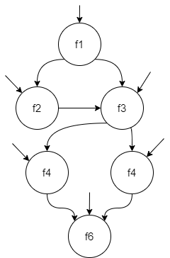

a. Vẽ biểu đồ cho các yêu cầu gọi

b. Các đường dẫn của đồ thị cho mỗi ca kiểm thử:
- `t1`: `[f1, f3, f5, f6]`
- `t2`: `[f1, f3, f4, f6]`
- `t3`: `[f1, f2]`
- `t4`: `[f1, f2, f3, f4, f6]`

c. Bộ kiểm thử nhỏ nhất đạt Bao phủ điểm:

Bộ kiểm thử cần tìm là: `{t1,t5}`

d. Bộ kiểm thử nhỏ nhất đạt Bao phủ cạnh:

Bộ kiểm thử cần tìm là: `{t1,t5}`

e. Đường dẫn quan trọng không bao đường nào trên tập kiểm thử trên:

Đường dẫn cần tìm là: `{f1,f2, f3, f5, f6}`
