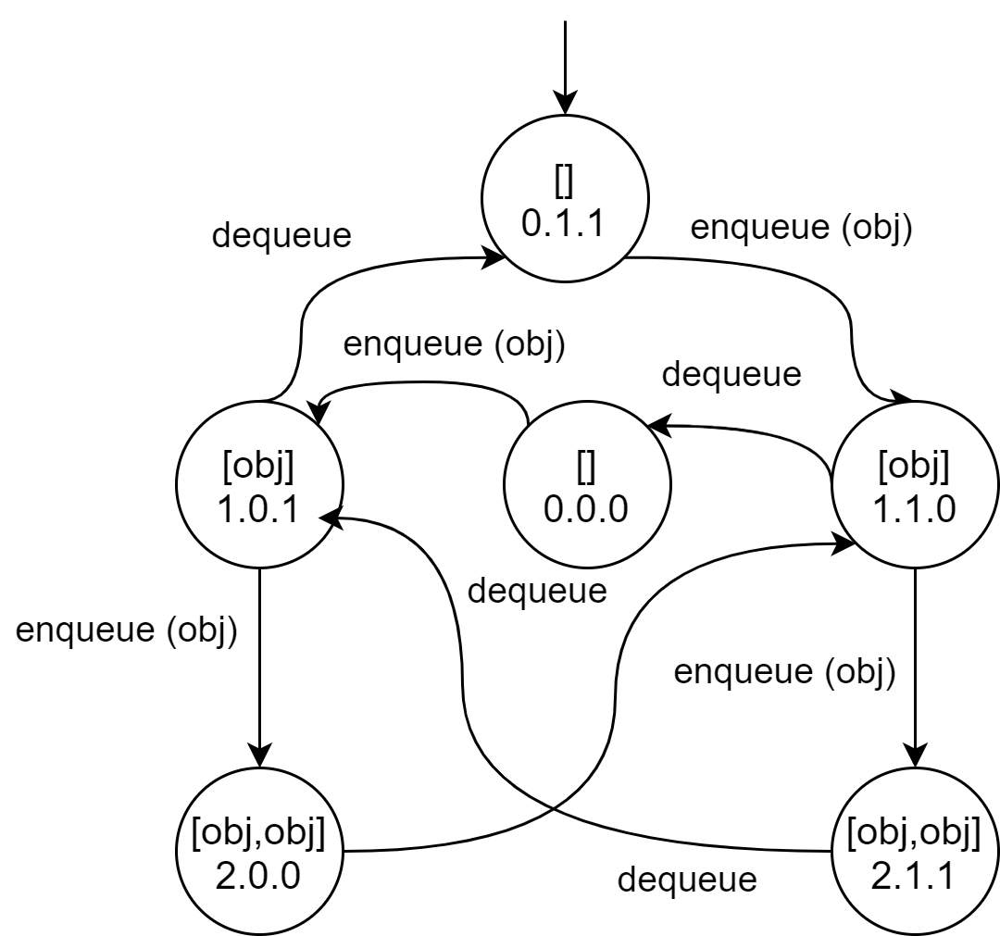

a. Liệt kê 4 biến hữu dụng trong bài:

Bốn giá trị cho các phần tử lần lượt là:
- `[null,null]`
- `[obj,null]`
- `[null,obj]`
- `[obj,obj]`

b. Có bao nhiêu trạng thái?

Có tất cả là 4 * 3 * 2 * 2 = **48** trạng thái.

c. Có bao nhiêu trạng thái có thể tiếp cận được?

Có 6 trạng thái có thể tiếp cận được.

d. Chỉ ra những trạng thái tiếp cận được bằng hình vẽ:
 
 Những trạng thái có thể tiếp cận được




e. Thêm cạnh cho phương thức `enqueue()` và `dequeue()` ?

- Phương thức `enqueue()`:
```java
public void enqueue (Object o) 
    throws NullPointerException, IllegalStateException 
{ 
    if (o == null) 
        throw new NullPointerException ("Queue.enqueue");
    else if (size == capacity) 
        throw new IllegalStateException ("Queue.enqueue"); 
    else
    {
      size++;
      elements[back] =o;
      back = (back+1) % capacity;
    }
}
```

- Phương thức `dequeue()`:
```java
public void dequeue () throws IllegalStateException 
{ 
    if (size == 0) 
        throw new IllegalStateException ("Queue.dequeue");
    else
    {
      size--;
      Object o = element [(front % capacity)];
      elements[front] = (front+1) % capacity;
      return o;
    }
}
```

f. Định nghĩa một ca kiểm thử đạt yêu cầu bao phủ cạnh.

Chuỗi lệnh sau đáp ứng đủ tiêu chuẩn bao phủ cạnh:
```java
Queue q = new Queue();
Object obj = new Object();
q.enqueue(obj); 
q.enqueue(obj); 
q.dequeue(); 
q.enqueue(obj); 
q.dequeue(); 
q.dequeue(); 
q.enqueue(obj); 
q.dequeue();
```
