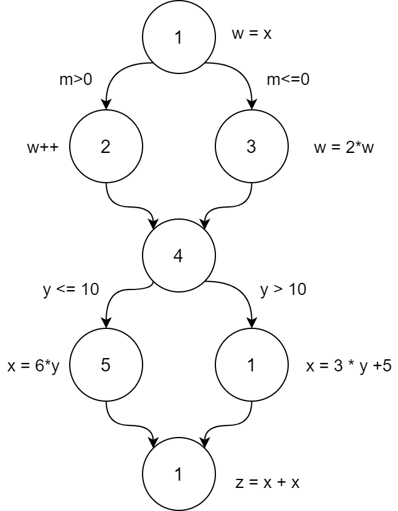

a. 

b. 
| Trạng thái hiện tại | Tình trạng | Trạng thái kế tiếp |
|---------------|-----------|------------|
| Idle | `a v b` | Active |
| Idle | `-a ^ -b` | Idle |
| Active | `a ^ b` | Idle |
| Active | `-b` | WindDown |
| Active | `-a ^ b` | Active |
| WindDown | `a` | Idle |
| WindDown | `-a` | WindDown |

c. 
- Hoạt động chuyển tiếp (Active) → Không hoạt động (Idle): 
  - Vị ngữ = `a∧b`
  - `(a, b)` = `(T, T)`, `(F, T)` và `(T, F)`
- Hoạt động chuyển tiếp (Active) → WindDown: 
  - Vị ngữ = `¬b`
  - `(a, b)` = `(x, T)` và `(x, F)` 
- Chuyển đổi Hoạt động (Active) → Hoạt động (Active)
  - Vị từ = `¬a∧b`
  - `(a, b)` = `(F, T)`, `(T, T)` và `(F, F)`