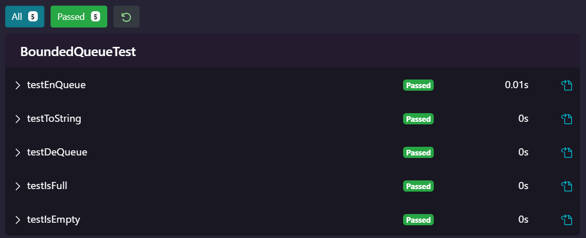

# Develop JUnit tests for the ```BoundedQueue``` class.

### Kết quả chạy test của em:


### File BoundedQueue.java (lấy từ website của cuốn sách):
```
// Introduction to Software Testing
// Authors: Paul Ammann & Jeff Offutt
// Chapter 3, page ??
// See BoundedQueueTest.java for JUnit tests. (Instructor only)

public class BoundedQueue
{ 
   // Overview:  a BoundedQueue is a mutable, bounded FIFO data structure
   // of fixed size , with size being set in the constructor
   // A typical Queue is [], [o1], or [o1, o2], where neither o1 nor o2
   // are ever null.  Older elements are listed before newer ones.

   private final Object[] elements;
   private int size, front, back;
   private final int capacity;

   public BoundedQueue (int capacity)
   {
      if (capacity < 0)
         throw new IllegalArgumentException ("BoundedQueue.constructor");
      this.capacity = capacity;
      elements = new Object [capacity];
      size  = 0; front = 0; back  = 0;
   }

   public void enQueue (Object o)
      throws NullPointerException, IllegalStateException
   {  // Modifies: this
      // Effects:   If argument is null throw NullPointerException
      // else if this is full, throw IllegalStateException,
      // else make o the newest element of this
      if (o == null)
         throw new NullPointerException ("BoundedQueue.enQueue");
      else if (size == capacity)
         throw new IllegalStateException ("BoundedQueue.enQueue");
      else
      {
         size++;
         elements [back] = o;
         back = (back+1) % capacity;
      }
   }
   
   public Object deQueue () throws IllegalStateException
   {  // Modifies: this
      // Effects:   If queue is empty, throw IllegalStateException,
      // else remove and return oldest element of this
   
      if (size == 0)
         throw new IllegalStateException ("BoundedQueue.deQueue");
      else
      {
         size--;
         Object o = elements [ (front % capacity) ];
         elements [front] = null;
         front = (front+1) % capacity;
         return o;
      }
   }
   
   public boolean isEmpty()
   { 
      return (size == 0); 
   }
   public boolean isFull() 
   { 
      return (size == capacity); 
   }
   
   public String toString()
   {
      String result = "[";
      for (int i = 0; i < size; i++)
      {
         result += elements[ (front + i) % capacity ] . toString();
         if (i < size -1) {
            result += ", ";
         }
      }
      result += "]";
      return result;
   }
   
}

```
### File BoundedQueueTest.java của em (File được để trong thư mục Assets):
```
import static org.junit.jupiter.api.Assertions.assertEquals;
import static org.junit.jupiter.api.Assertions.assertFalse;
import static org.junit.jupiter.api.Assertions.assertTrue;

import org.junit.After;
import org.junit.Before;
import org.junit.Test;

public class BoundedQueueTest {
  private BoundedQueue queue;

  @Before
  public void setUp() {
    this.queue = new BoundedQueue(5);
  }

  @After
  public void after() {
    queue = null;
  }

  @Test
  public void testEnQueue() {
    String temp = "Test String";
    queue.enQueue(temp);
    assertFalse(queue.isEmpty());
  }

  @Test
  public void testDeQueue() {
    String temp = "Test String";
    queue.enQueue(temp);
    assertEquals(temp, queue.deQueue());
  }

  @Test
  public void testIsEmpty() {
    assertTrue(queue.isEmpty());
  }

  @Test
  public void testIsFull() {
    String temp1 = "Test String 1";
    String temp2 = "Test String 2";
    String temp3 = "Test String 3";
    String temp4 = "Test String 4";
    String temp5 = "Test String 5";

    queue.enQueue(temp1);
    queue.enQueue(temp2);
    queue.enQueue(temp3);
    assertFalse(queue.isFull());
    queue.enQueue(temp4);
    queue.enQueue(temp5);
    assertTrue(queue.isFull());
  }

  @Test
  public void testToString() {
    String eval = "[Test String 1, Test String 2, Test String 3]";
    String temp1 = "Test String 1";
    String temp2 = "Test String 2";
    String temp3 = "Test String 3";
    queue.enQueue(temp1);
    queue.enQueue(temp2);
    queue.enQueue(temp3);
    assertEquals(eval, queue.toString());
  }
}

```