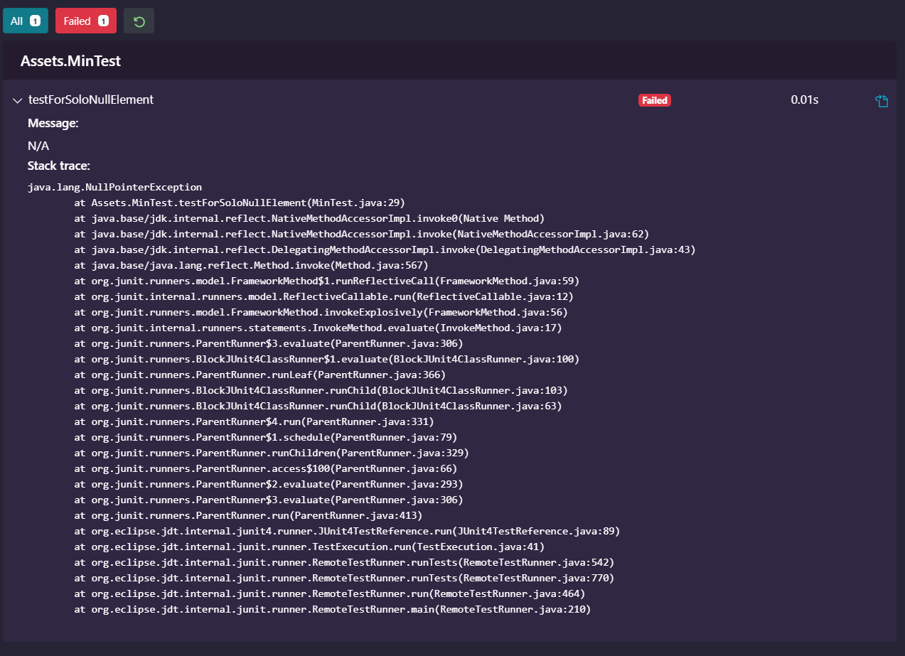

# Delete the explicit throw of NullPointerException in the Min program (Figure 3.2). Verify that the JUnit test for a list with a single null element now 

### Kết quả test:


### File Min.java (đã xoá dòng throwException như đề bài, lấy từ website của sách): 
```
package Assets;

// Introduction to Software Testing
// Authors: Paul Ammann & Jeff Offutt
// Chapter 3; page ??
// See MinTest.java for JUnit tests.
// See DataDrivenMinTest.java for JUnit tests. (Instructor only)

import java.util.*;

public class Min
{
  /**
    * Returns the mininum element in a list
    * @param list Comparable list of elements to search
    * @return the minimum element in the list
    * @throws NullPointerException if list is null or
    *         if any list elements are null
    * @throws ClassCastException if list elements are not mutually comparable
    * @throws IllegalArgumentException if list is empty
    */
    public static <T extends Comparable<? super T>> T min (List<? extends T> list)
    {
       if (list.size() == 0)
       {
          throw new IllegalArgumentException ("Min.min");
       }

       Iterator<? extends T> itr = list.iterator();
       T result = itr.next();

    //    if (result == null) throw new NullPointerException ("Min.min");

       while (itr.hasNext())
       {   // throws NPE, CCE as needed
           T comp = itr.next();
           if (comp.compareTo (result) < 0)
           {
               result = comp;
           }
       }
       return result;
    }
}

```

### File MinTest (trích và rút gọn theo sách, được để trong file MinTest.java ở thư mục Assets):
```
package Assets;

import static org.junit.Assert.assertThrows;

import java.util.ArrayList;
import java.util.List;

import org.junit.After;
import org.junit.Before;
import org.junit.Test;
import org.junit.jupiter.api.AfterEach;
import org.junit.jupiter.api.BeforeEach;

public class MinTest {
  private List<String> list;
  
  @BeforeEach
  public void setUp() {
    list = new ArrayList<String>();
  }
  @AfterEach
  public clean() {
    list = null;
  }

  @Test
  public void testForSoloNullElement()
  {
     list.add (null);
     assertThrows(NullPointerException.class, () -> Min.min (list));
  }

}
```
