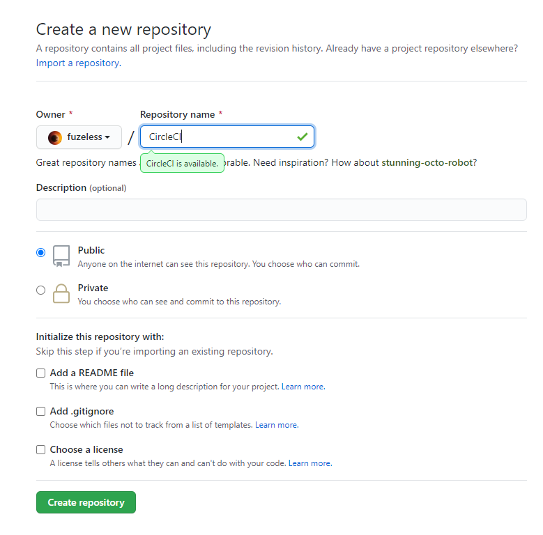
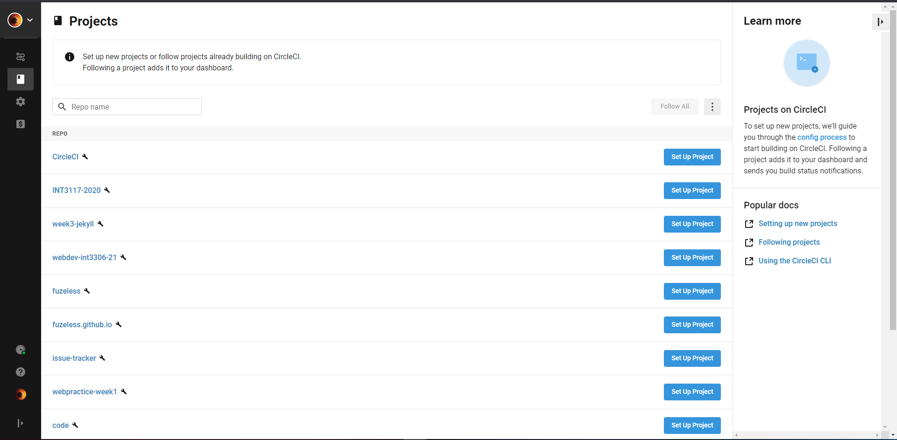
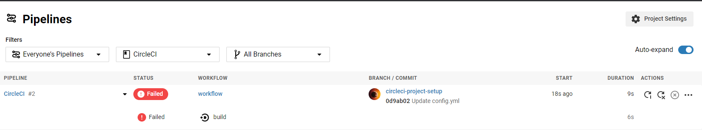

# Set  up  a  continuous  integration  server.  Include  version  control  forboth source code and tests, and populate both with a simple example.Experiment with “breaking the build,” by either introducing a faultinto the source code or adding a failing test case. Restore the build.

Em sẽ dùng CircleCI cho bài tập này.

### Đầu tiên em tạo một repo trống: 


### Sau đó, em lên CircleCI và khởi tạo dự án:



### Luồng công việc (Pipeline) đầu tiên thành công:


### Vì tệp config.yml chỉ chứa cấu hình đơn giản mà mọi bộ kiểm thử đều "Passed", em sẽ chỉnh file config.yml một chút để Pipeline của nó thất bại (Tệp config.yml được lấy từ tài liệu của CircleCI): 
```
version: 2.1
orbs:
  node: circleci/node@1.1
jobs:
  build:
    executor:
      name: node/default
      tag: '10.4'
    steps:
      - checkout
      - node/with-cache:
          steps:
            - run: npm install
      - run: npm run test
```

### Sau khi cập nhật cấu hình, CircleCI sẽ tự động chạy lại Pipeline của nó, và kết quả sẽ cho ra là thất bại:


Nguyên nhân thất bại là vì config.yml đã thiết lập chuyển sang môi trường node, mà repo của em chưa cài đặt node nên những câu lệnh như ```npm install``` sẽ không chạy được.

### Để khắc phục lỗi trên, em sẽ cài đặt môi trường node vào repo của em:
```
jobs:
  install-node-example:
    docker:
      - image: 'cimg/base:stable'
    steps:
      - checkout
      - node/install:
          install-yarn: true
      - run: node --version
orbs:
  node: circleci/node@1.1
version: 2.1
workflows:
  node_install:
    jobs:
      - install-node-example
```
### Và kết quả kiểm thử đã thành công:


### Repo của em được công bố trên trang: <https://github.com/fuzeless/CircleCI>