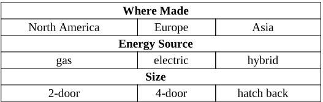

# A tester defined three characteristics based on the input parameter car: Where Made, Energy Source, and Size. The following partitionings for these characteristics have at least two mistakes. Correct them.

- Lỗi đầu tiên sẽ nằm ở tính chất nơi sản xuất của xe (Where made): các xe có thể được sản xuất ở những nơi khác ngoài 3 khu vực ghi ở trên (Ví dụ như ở Africa, North Pole, ...). Đề xuất của em là cho thêm một khối tên là những nơi khác (Others).
- Lỗi thứ hai là những xe có cửa sau (hatch back) cũng có thể là các xe có 2 cửa hoặc 4 cửa, nên khối hatch back sẽ bị giao với khối 2-door hoặc 4-door. Đề xuất của em là bỏ khối hatch back đi và thay vào đó bằng 2 khối: hatch back 2-door và hatch back 4-door.