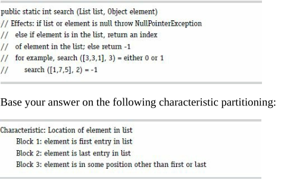

### (a) “Location of element in list” fails the disjointness property. Give an example that illustrates this:

Một trong những trường hợp mà tính chất của phân hoạch kia gặp vấn đề về tính độc lập đó chính là các phần tử trong danh sách đều giống nhau. Ví dụ:
```
List: [3, 3, 3, 3]
Element: 3
```
Ví dụ trên sẽ cho thấy sự vi phạm tính độc lập giữa các khối phân hoạch.

### (b) “Location of element in list” fails the completeness property. Give an example that illustrates this.

Một trường hợp cơ bản nhất mà không nằm trong các khối trên là phần tử cần tìm không nằm trong danh sách. Ví dụ:
```
List: [1, 2, 3, 4, 5]
Element: 6
```

### (c) Supply one or more new partitions that capture the intent of “Location of element in list” but do not suffer from completeness or disjointness problems.

Một cách phân hoạch lại tính chất của đề bài là thêm một khối chứa những phần tử không nằm trong danh sách:
```
Characteristic: Location of element in list
    Block 1: Element is first entry in list.
    Block 2: Element is last entry in list.
    Block 3: Element is in some position other than first or last.
    Block 4: Element is not in list
```