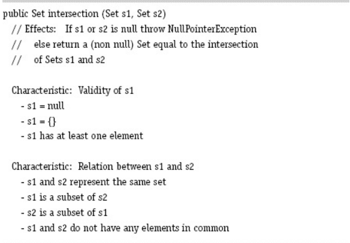

### (a) Does the partition “Validity of s1” satisfy the completeness property? If not, give a value for s1 that does not fit in any block.

Phân hoạch "Validity of s1" có phù hợp với tính bao quát (completeness) của một phân hoạch, vì nó bao quát tất cả các trường hợp có thể có của 2 tập giao nhau: null (nếu 2 tập đầu vào là null), rỗng (không có phần tử giao nhau), và ít nhất 1 phần tử giao nhau.

### (b) Does the partition “Validity of s1” satisfy the disjointness property? If not, give a value for s1 that fits in more than one block.

Phân hoạch "Validity of s1" vẫn phù hợp với tính độc lập (disjointness) của một phân hoạch, vì các khối đều độc lập với nhau, không khối nào giao khối nào.

### (c) Does the partition “Relation between s1 and s2” satisfy the completeness property? If not, give a pair of values for s1 and s2 that does not fit in any block.

Thuộc tính "Relation between s1 and s2" không thoả mãn tính bao quát (completeness) của phân hoạch. Một ví dụ điển hình là 2 tập có các phần tử chung với nhau nhưng không hoàn toàn không có mối quan hệ tập con giữa chúng: 
```
s1: [1, 2, 3, 4]
s2: [1, 2, 3, 5, 6]
```

### (d) Does the partition “Relation between s1 and s2” satisfy the disjointness property? If not, give a pair of values for s1 and s2 that fits in more than one block.

Thuộc tính "Relation between s1 and s2" không thoả mãn tính độc lập (disjointness) của phân hoạch. Ví dụ là 2 tập đều có các phần tử giống nhau, vậy nên khối 1, 2 và 3 đều thoả mãn: 
```
s1: [1, 2, 3, 4]
s2: [1, 2, 3, 4]
```
### (e) If the “Base Choice” criterion were applied to the two partitions (exactly as written), how many test requirements would result?

Sẽ phải viết 1 yêu cầu cho (Base test), 2 yêu cầu cho thuộc tính đầu tiên và 3 cái cho thuộc tính thứ 2 => có 6 yêu cầu tất cả

### (f) Revise the characteristics to eliminate any problems you found.

Em sẽ sửa lại thuộc tính thứ 2 của chương trình:
```
Characteristic: Relation between s1 and s2
    - s1 and s2 represents the same set
    - s1 and s2 have at least one element in common
    - s1 is a subset of s2, but not the same set as s2
    - s2 is a subset of s1, but not the same set as s1
```