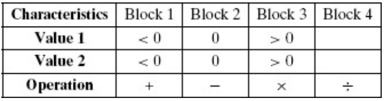

# Use the following characteristics and blocks for the questions below.


### (a) Give tests to satisfy the Each Choice criterion.

Các bộ kiểm thử sử dụng tiêu chí (tạm dịch) kiểm thử chọn lọc (Each Choice) là: (Xếp theo thứ tự (Value 1, Value 2, Operation))
```
(-1, -1, +)
(0, 0, -)
(1, 1, x)
(2, 2, ÷)
```
### (b) Give tests to satisfy the Base Choice criterion. Assume base choices are Value 1 = > 0, Value 2 = > 0, and Operation = +.
Các bộ kiểm thử dựa trên tiêu chí kiểm thử chọn theo gốc (Base choice) là: (Em chọn bộ kiểm thử gốc là (1, 1, +))
```
(-1, 1, +)
(0, 1, +)

(1, -1, +)
(1, 0, +)

(1, 1, -)
(1, 1, x)
(1, 1, ÷)
```

### (c) How many tests are needed to satisfy the All Combinations criterion? (Do not list all the tests!)
Ta có 3 thuộc tính trong phân hoạch, mỗi thuộc tính lại có 4 khối, trong đó khối 4 có 2 thuộc tính Value 1, Value 2 không có điều kiện đầu vào. Vậy nên ta có **3 x 3 x 4 = 36** ca kiểm thử dựa trên tiêu chí ACoC.

### (d) Give tests to satisfy the Pair-Wise Coverage criterion.
Các ca kiểm thử thoả mãn tiêu chí kiểm thử ghép cặp (Pair-wise) là: 
```
(-1, -1, +)
(-1, 0, -)
(-1, 1, x)
(-1, 2, ÷)

(0, -1, -)
(0, 0, x)
(0, 1, ÷)
(0, 2, +)

(1, -1, x)
(1, 0, ÷)
(1, 1, +)
(1, 2, -)
```