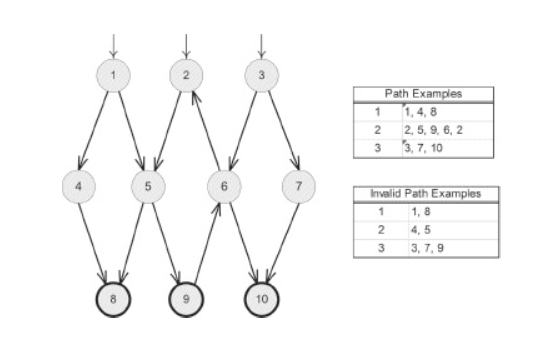

# List all test paths in Figure 7.2:


Tất cả các đường đi kiểm thử (Test Path) có thể có là:

```
(1, 4, 8)
(1, 5, 8)
(1, 5, 9)
(1, 5, 9, 6)
(1, 5, 9, 6, 2)
(1, (5, 9, 6, 2)*)
(1, 5, 9, 6, 10)
(2, 5, 9)
(2, 5, 9, 6)*,
((2, 5, 9, 6)*, 10)
(3, 6, 10)
(3, 7, 10)
```