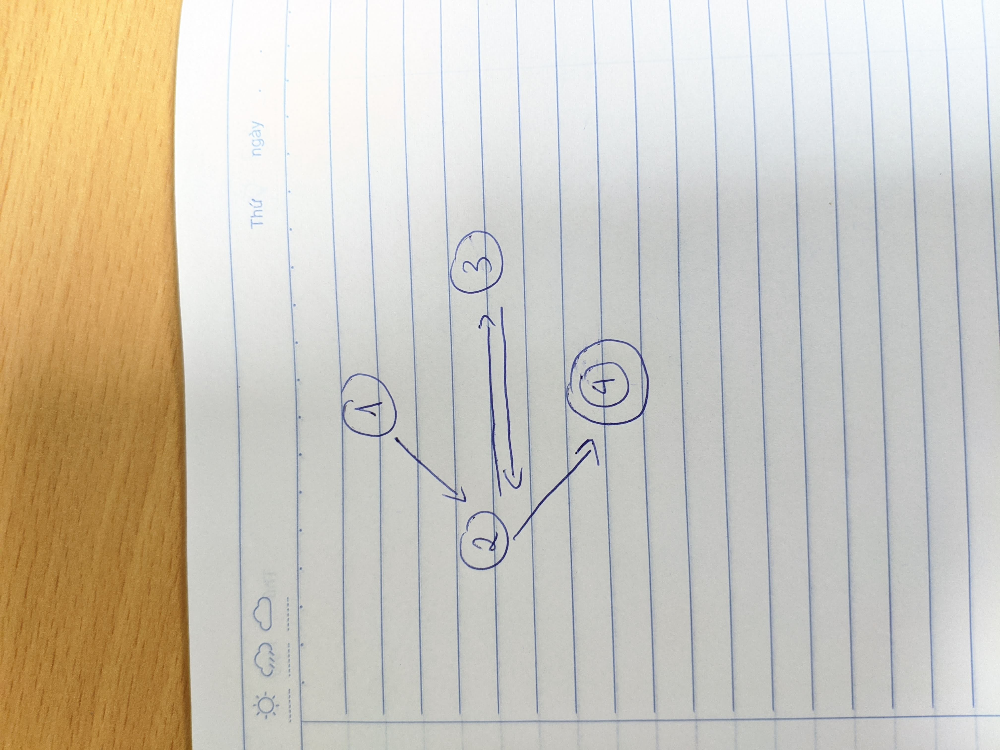

# Answer questions a-d for the graph defined by the following sets:
## • N = {1, 2, 3, 4}
## • N0 = {1}
## • Nf = {4}
## • E = {(1, 2), (2, 3), (3, 2), (2, 4)}

### (a) Draw the graph.


### (b) If possible, list test paths that achieve Node Coverage, but not Edge Coverage. If not possible, explain why not.

Không có đường đi kiểm thử nào phù hợp với tiêu chí mà đề bài giao. Vì mọi đường đi đều bắt đầu từ điểm 1 và phải đi lần lượt theo các cạnh đã cho thì mới bao phủ được hết các điểm của đồ thị. Tuy nhiên nếu bao phủ được hết các điểm thì nó cũng đã bao phủ hết tất cả các cạnh rồi.

### (c) If possible, list test paths that achieve Edge Coverage, but not Edge-Pair Coverage. If not possible, explain why not.

Đường đi kiểm thử mà thoả mãn tiêu chí bao phủ cạnh nhưng không thoả mãn tiêu chí bao phủ cặp cạnh là:
```
{1, 2, 3, 2, 4}
```

### (d) List test paths that achieve Edge-Pair Coverage.

Đường đi kiểm thử mà thoả mãn tiêu chí bao phủ cặp cạnh là:

```
{1, 2, 4}, {1, 2, 3, 2, 3, 2, 4}
```