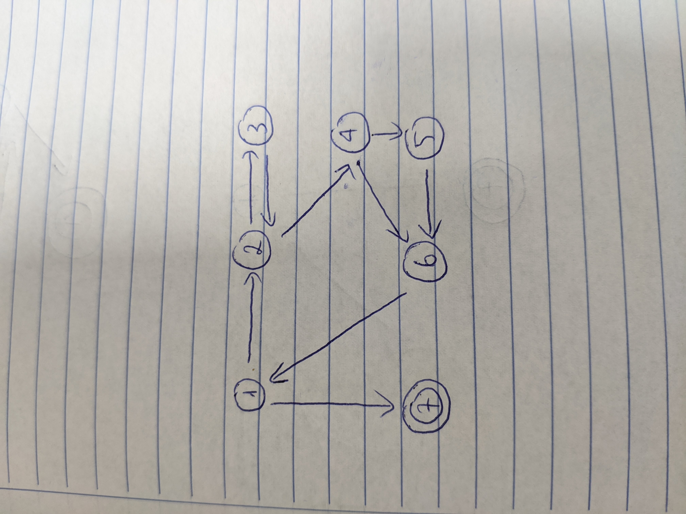

# Answer questions a–g for the graph defined by the following sets:
## N = {1, 2, 3, 4, 5, 6, 7}
## N0 = {1}
## Nf = {7}
## E = {(1, 2), (1, 7), (2, 3), (2, 4), (3, 2), (4, 5), (4, 6), (5, 6), (6, 1)}
# Also consider the following (candidate) test paths:
## p1 = [1, 2, 4, 5, 6, 1, 7]
## p2 = [1, 2, 3, 2, 4, 6, 1, 7]
## p3 = [1, 2, 3, 2, 4, 5, 6, 1, 7]

### (a) Draw the graph


### (b) List the test requirements for Edge-Pair Coverage. (Hint: You should get 12 requirements of length 2.)

Các yêu cầu kiểm thử thoả mãn bao phủ cặp cạnh là: 
```
{1, 2, 3}, {1, 2, 4}, {2, 3, 2}, {2, 4, 5}, {2, 4, 6}, {3, 2, 3}, {3, 2, 4}, {4, 5, 6}, {4, 6, 1}, {5, 6, 1}, {6, 1, 7}, {6, 1, 2}
```

### (c) Does the given set of test paths satisfy Edge-Pair Coverage? If not, state what is missing.

Các đường đi kiểm thử trên không thoả mãn tiêu chí bao phủ cặp cạnh.

### (d) Consider the simple path [3, 2, 4, 5, 6] and test path [1, 2, 3, 2, 4, 6, 1, 2, 4, 5, 6, 1, 7]. Does the test path tour the simple path directly? With a sidetrip? If so, write down the sidetrip.

Các đường đi kiểm thử trên không tour một cách trực tiếp. Tuy nhiên, chúng có sidetrip: ```{4, 6, 1, 2}```

### (e) List the test requirements for Node Coverage, Edge Coverage, and Prime Path Coverage on the graph.

Các yêu cầu đường đi kiểm thử:
```
Node Coverage: {1, 2, 3, 4, 5, 6, 7}
Edge Coverage: {1, 2}, {2, 3}, {3, 2}, {2, 4}, {4, 5}, {5, 6}, {4, 6}, {6, 1}, {1, 7}
Prime Path Coverage: {1, 2, 4, 5, 6, 1}, {1, 2, 4, 6, 1}, {2, 4, 6, 1, 2}, {2, 4, 5, 6, 1, 2}, {3, 2, 4, 6, 1, 7}, {3, 2, 4, 5, 6, 1, 7}, {4, 6, 1, 2, 4}, {4, 5, 6, 1, 2, 4}, {4, 6, 1, 2, 3}, {4, 5, 6, 1, 2, 3}, {5, 6, 1, 2, 4, 5}, {6, 1, 2, 4, 6}, {6, 1, 2, 4, 5, 6}, {3, 2, 3}, {2, 3, 2}
```

### (f) List test paths from the given set that achieve Node Coverage but not Edge Coverage on the graph.

Đường đi thoả mãn yêu cầu của đề bài là: 
{1, 2, 3, 2, 4, 5, 6, 1, 7}

### (g) List test paths from the given set that achieve Edge Coverage but not Prime Path Coverage on the graph.

Đường đi thoả mãn yêu cầu đề bài là: 
{1, 2, 4, 6, 1, 7}