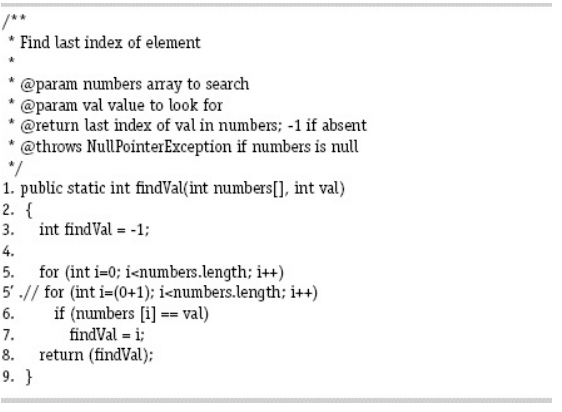

# Answer questions (a) through (d) for the mutant on line 5 in the method findVal().



### (a) If possible, find test inputs that do not reach the mutant.
Đoạn mã đột biến luôn được chạy (vì nó là vòng lặp ```for```), kể cả nếu mảng đầu vào là mảng ```null``` hoặc là mảng rỗng.

### (b) If possible, find test inputs that satisfy reachability but not infection for the mutant.
Đoạn mã trên sẽ luôn được thực thi, và việc lây nhiễm là không thể tránh khỏi, vì giá trị ```i``` đã bị gán sai giá trị ngay từ đầu.

### (c) If possible, find test inputs that satisfy infection, but not propagation for the mutant.
Bởi vì vòng lặp ```for``` trên luôn bỏ qua phần tử đầu tiên của mảng, nên nếu giá trị ```val``` cần tìm không nằm ở đầu mảng thì đoạn mã sẽ vẫn chạy bình thường.

Ví dụ:
```
numbers = [1, 2, 3]
val = 2
```

### (d) If possible, find test inputs that strongly kill the mutants.
Mảng đầu vào có giá trị ```val``` nằm ở đầu thì sẽ triệt tiêu được đột biến đó.
```
numbers = [1, 2, 3]
val = 1
```