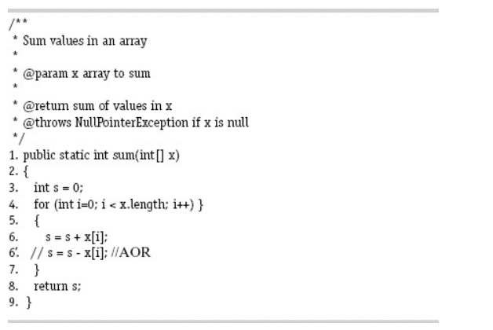

# Answer questions (a) through (d) for the mutant on line 6 in the method sum().


### (a) If possible, find test inputs that do not reach the mutant.
Nếu mảng đầu vào ```x``` là một mảng rỗng, hoặc giá trị ```null```, thì vòng lặp ```for``` sẽ không bao giờ được chạy, nên đoạn mã đột biến sẽ không được thực thi.

### (b) If possible, find test inputs that satisfy reachability but not infection for the mutant.
Chỉ có trường hợp tất cả các giá trị đầu vào của hàm đều bằng ```0``` thì đoạn mã đột biến sẽ không bị lây nhiễm (bởi vì các giá trị đều bằng ```0```, cộng hay trừ nó vẫn sẽ là ```0```).
Ví dụ:
```
x = [0, 0, 0]
```

### (c) If possible, find test inputs that satisfy infection, but not propagation for the mutant.
Chỉ có trường hợp là tổng tất cả phần tử của mảng bằng ```0``` (trừ trường hợp ở câu b) thì đoạn mã sẽ bị lây nhiễm, nhưng không lan truyền.
Ví dụ:
```
x = [1, -1, 2, -2]
sum = 0
```

### (d) If possible, find test inputs that strongly kill the mutants.
Mọi giá trị đầu vào mà khác ```0``` sẽ là cơ sở để triệt đột biến.
Ví dụ:
```
x = [1, 2, 3]
```