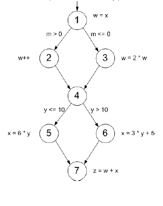

# Chapter 7.3.1
## 6. Answer questions a–c for the graph in Figure 7.2.
## (a) Draw a control flow graph for this program fragment. Use the
node numbers given above.
## (b) Which nodes have defs for variable w?
## (c) Which nodes have uses for variable w?
## (d) Are there any du-paths with respect to variable w from node 1 to node 7? If not, explain why not. If any exist, show one.
## (e) List all of the du-paths for variables w and x.

 

## (a):

## (b): 1,2,3

## (c): 2,3,7
## (d): không
## (e):[1, 2],[1, 3],[2, 4, 5, 7],[2, 4, 6, 7],[3, 4, 5, 7],[3, 4, 6, 7],[5, 7],[6, 7].