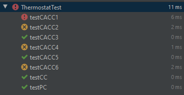

# Chapter 8.3-1,2,3
## 1. Complete and run the tests to satisfy PC for the Thermostat class.
## 2. Complete and run the tests to satisfy CC for the Thermostat class.
## 3. Complete and run the tests to satisfy CACC for the Thermostat class.

<br>

### File ThermostatTest:
```java
public class ThermostatTest{
    public Thermostat thermo = new Thermostat();
    public ProgrammedSettings settings = new ProgrammedSettings();
    public void init(){
        settings.setSetting(Period.MORNING, DayType.WEEKDAY,69);
        thermo.setPeriod(Period.MORNING);
        thermo.setDay(DayType.WEEKDAY);
    }
    public void clauseATrue(){
        thermo.setCurrentTemp(63);
        thermo.setThresholdDiff(5);
    }
    public void clauseAFalse(){
        thermo.setCurrentTemp(66);
        thermo.setThresholdDiff(5);
    }
    public void clauseBTrue(){
        thermo.setOverride(true);
    }
    public void clauseBFalse(){
        thermo.setOverride(false);
    }
    public void clauseCTrue(){
        thermo.setOverTemp(72);
    }
    public void clauseCFalse(){
        thermo.setOverTemp(67);
    }
    public void clauseDTrue(){
        thermo.setMinLag(10);
        thermo.setTimeSinceLastRun(12);
    }
    public void clauseDFalse(){
        thermo.setMinLag(10);
        thermo.setTimeSinceLastRun(8);
    }
    @Test public void testPC(){
        init();
        // Clause a: curTemp< dTEmp - threshholdDiff : true
        thermo.setCurrentTemp(63);
        thermo.setThresholdDiff(5);

        //Clause b: Override:true
        thermo.setOverride(true);

        //Clause c: curTemp< overTemp - thresholdDiff:true
        thermo.setOverTemp(70);

        //Clause d: timeSinceLastRun.greaterthan(minLag):true
        thermo.setMinLag(10);
        thermo.setTimeSinceLastRun(12);
        assertTrue(thermo.turnHeaterOn(settings));
    }
    @Test public void testCC(){
        init();
        // TTTT
        clauseATrue();
        clauseBTrue();
        clauseCTrue();
        clauseDTrue();
        assertTrue(thermo.turnHeaterOn(settings));
    }
    @Test public void testCACC1(){
        // T t f t
        clauseATrue();
        clauseBTrue();
        clauseCFalse();
        clauseDTrue();
        assertTrue(thermo.turnHeaterOn(settings));

    }
    @Test public void testCACC2(){
        // F t f t
        init();
        clauseAFalse();
        clauseBTrue();
        clauseCFalse();
        clauseDTrue();
        assertTrue(thermo.turnHeaterOn(settings));

    }
    @Test public void testCACC3(){
        // f T t t
        init();
        clauseAFalse();
        clauseBTrue();
        clauseCTrue();
        clauseDTrue();
        assertTrue(thermo.turnHeaterOn(settings));

    }
    @Test public void testCACC4(){
        // f F t t
        init();
        clauseAFalse();
        clauseBFalse();
        clauseCTrue();
        clauseDTrue();
        assertTrue(thermo.turnHeaterOn(settings));

    }
    @Test public void testCACC5(){
        // t t t T
        init();
        clauseATrue();
        clauseBTrue();
        clauseCTrue();
        clauseDTrue();
        assertTrue(thermo.turnHeaterOn(settings));

    }
    @Test public void testCACC6(){
        // t t t F
        init();
        clauseATrue();
        clauseBTrue();
        clauseCTrue();
        clauseDFalse();
        assertTrue(thermo.turnHeaterOn(settings));

    }
}

```
<br>

### Kết quả:
