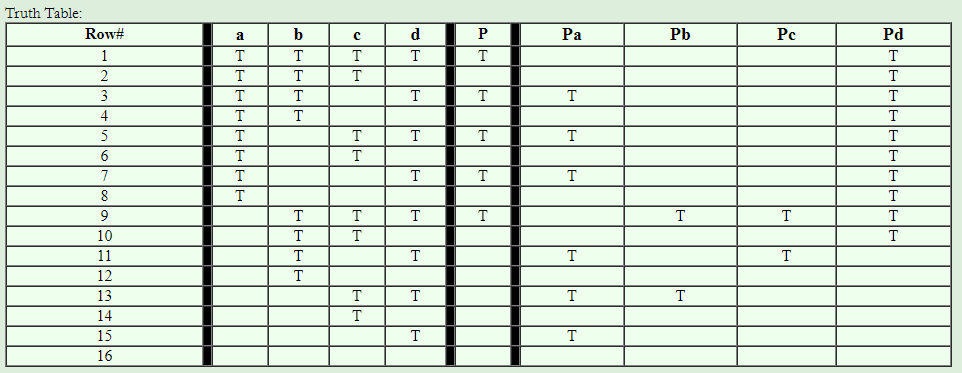

# Chapter 8.3-4
## 4. For the Thermostat class, check the computations for how to make each major clause deter- mine the value of the predicate by using the online tool, then the tabular method.
 

## Bảng chân trị:

