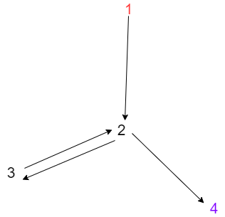

+ Vẽ đồ thị:

đỏ là điểm ,đầu tím là điểm cuối .
+ b ) Không thể vì mọi đường đi kiểm thử bắt đầu từ nút 1 đi qua nút 2 vs kết thúc ở 4 . vậy nên bất cứ đường nào ghé thăm nút 3 thì sẽ thăm cả 2 cạnh (2, 3) và (3, 2)
+ c)  các đường đi đạt được bao hàm cặp cạnh là:
    
       T={[1,2,4],[1,2,3,2,3,2,4]}