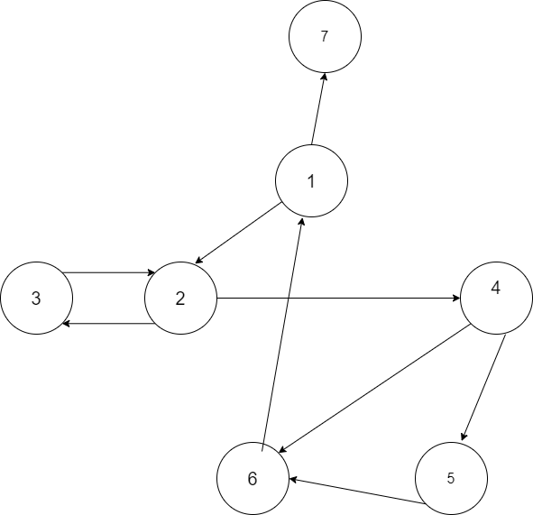

+ Vẽ đồ thị:

  **1 là điểm đầu và 7 là điểm cuối**
+ b) các yêu cầu kiểm thử cho bao hàm cặp cạnh là: 
    TR = {[1,2,3],[1,2,4],[2,3,2],[2,4,5],[2,4,6],[3,2,3],[3,2,4],[4,5,6],[4,6,1],[5,6,1],[6,1,2],[6,1,7]}
+ (c) Đường đi kiểm thử cho sẵn có thỏa mãn bao hàm cặp cạnh không?
    Không. Vì còn thiếu [3,2,3] và [6,1,2]
+ Cho đường đi đơn giản [3,2,4,5,6] và đường đi kiểm thử [1,2,3,2,4,6,1,2,4,5,6,1,7]. Đường đi kiểm thử có tour đường đi đơn giản không?

    Có, nhưng mà cần phải có sidetrip. Đường đi đơn giản tour được với sidetrip  :
        [3,2,4,(6,1,2,4),5,6]

+ (e) Liệt kê yêu cầu kiểm thử cho bao hàm nút, bao hàm cạnh, bao hàm đường đi nguyên tố
    Bao hàm nút: TR = {1,2,3,4,5,6,7}
    Bao hàm cạnh: TR = {(1,2),(1,7),(2,3),(2,4),(3,2),(4,5),(4,6),(5,6),(6,1)}
    Bao hàm đường đi nguyên tố: TR = {[1,7],[2,3,2],[1,2,3,2],[5,6,1,7],[1,2,4,6,1],[2,4,6,1,7],[2,4,6,1,2],[1,2,4,5,6,1],[2,4,5,6,1,2],[2,4,5,6,1,7],[5,6,1,2,4,5]}

+ (f) Liệt kê đường đi kiểm thử đạt được bao hàm nút nhưng không bao hàm cạnh
     path(T) = {[1,2,3,2,4,5,6,1,7]}. Ngoài ra còn có vô tận các đường đi đạt được từ vòng lặp [2,3,2] và [1,2,4,5,6,1]

+ (g) Liệt kê đường đi kiểm thử đạt được bao hàm cạnh nhưng không bao hàm đường di nguyên tố
      path(T) = {[1,2,3,2,4,5,6,1,2,4,6,1,7]}. Ngoài ra còn có vô tận các đường đi đạt được từ vòng lặp [2,3,2], [1,2,4,6,1] và [1,2,4,5,6,1]