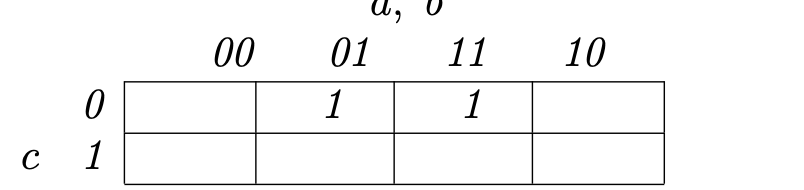
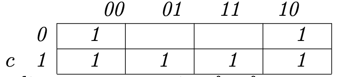
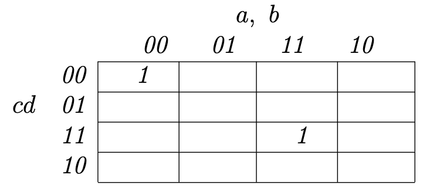
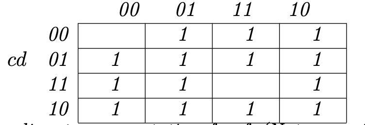
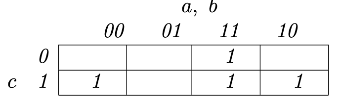
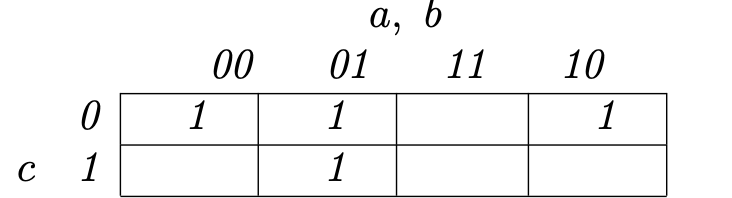
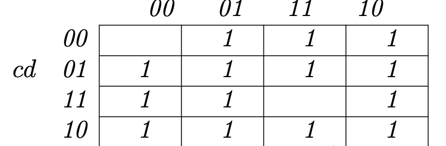
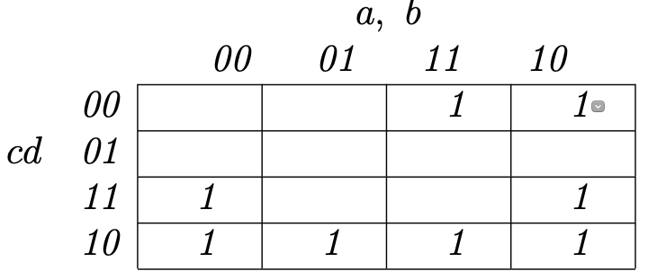

Bài 1:

Xét `f = abc ̄+a ̄bc ̄`

a) Vẽ bản đồ Karnaugh:

- Bản đồ Karnaugh cho f:

- Bản đồ Karnaugh cho f̄:

b) Nguyên tố không thừa thãi:

- `f = bc ̄`
- `f̄ = b̄ + c`

c) Bộ kiểm thử để thỏa mãn IC cho f:

- {xTF,xFT}

d) Bộ kiểm thử để thỏa mãn UTPC cho f:

- {xTF,xFF,xTT}

e) Bộ kiểm thử để thỏa mãn CUTPNFP cho f:

- {xTF,xFF,xTT}

Xét `f = a ̄bc ̄d + abcd`

a) Vẽ bản đồ Karnaugh:

- Bản đồ Karnaugh cho f:

- Bản đồ Karnaugh cho f̄:

b) Nguyên tố không thừa thãi:

- `f = ā̄b̄c̄d̄ + abcd`
- `f̄ = ab̄ + bc̄ + cd̄ + ād`

c) Bộ kiểm thử để thỏa mãn IC cho f:

- {FFFF,TTTT,TFTF,FTFT}

d) Bộ kiểm thử để thỏa mãn UTPC cho f:

- {FFFF,TTTT,TTFF,TFFF,FFTT,FFTF}

e) Bộ kiểm thử để thỏa mãn CUTPNFP cho f:

- {TTTT,FTTT,TFTT,TTFT,TTTF,FFFF,TFFF,FTFF,FFTF,FFFT}

Xét f = `f = ab + abc + a ̄bc`

a) Vẽ bản đồ Karnaugh:

- Bản đồ Karnaugh cho f:

- Bản đồ Karnaugh cho f̄:

b) Nguyên tố không thừa thãi:

- `f = ab + b̄c`
- `f̄ = āb + b̄c̄`

c) Bộ kiểm thử để thỏa mãn IC cho f:

- {TTx,xFT,FTx,xFF}

d) Bộ kiểm thử để thỏa mãn UTPC cho f:

- {TTx,xFT,FTx,xFF}

e) Bộ kiểm thử để thỏa mãn CUTPNFP cho f:

- {TTF,FTF,TFF,FFT,FFF,FTT}

Xét `f = a ̄c ̄d + c ̄d + bcd`

a) Vẽ bản đồ Karnaugh:

- Bản đồ Karnaugh cho f:

- Bản đồ Karnaugh cho f̄:

b) Nguyên tố không thừa thãi:

- `f = āc̄̄ + cd̄ + abd`
- `f̄ = ad̄ + b̄c + cd̄`

c) Bộ kiểm thử để thỏa mãn IC cho f:

- {FTFT,TFTF}

d) Bộ kiểm thử để thỏa mãn UTPC cho f:

- {FxFF,TFFT,xTTT,FTTF,TxFF,xFTT}

e) Bộ kiểm thử để thỏa mãn CUTPNFP cho f:

- {FFFF,TFFF,FFTF,TFFT,TFFF,TFTT,TTTT,TFTT,TTTF}
