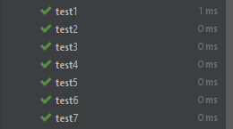

**Ca kiểm thử 1: dùng enQueue() để thêm 2 phần tử 1, 2 vào mảng**
```
public void test1()
    {
        BoundedQueue q = new BoundedQueue(2);
        q.enQueue(1);
        q.enQueue(2);
        //Object i = q.deQueue()();
        assertEquals("[1, 2]",q.toString());
    }
```
**Ca kiểm thử 2: dùng enQueue() để thêm 2 phần tử 1, 2 vào mảng, sau đó bỏ phàn tử đầu tiên đi bằng deQueue()**
```
public void test2()
    {
        // TODO Auto-generated method stub
        BoundedQueue q = new BoundedQueue(2);
        q.enQueue(1);
        q.enQueue(2);
        Object i = q.deQueue();
        assertEquals("[2]",q.toString());

    }
```
**Ca kiểm thử 3: dùng enQueue() để thêm 1 phần tử vào mảng với kích cỡ là 2, sau đó kiểm tra mảng đầy chưa bằng isFull()**
```
public void test3()
    {
        BoundedQueue q = new BoundedQueue(2);
        q.enQueue(1);
        assertEquals(false, q.isFull());
    }
```
**Ca kiểm thử 5: dùng enQueue() để thêm 1 phần tử vào mảng với kích cỡ là 2, sau đó kiểm tra mảng có rỗng không bằng isEmpty()**
```
public void test4()
    {
        BoundedQueue q = new BoundedQueue(2);
        q.enQueue(1);
        assertEquals(false, q.isEmpty());
    }
```
**Ca kiểm thử 6: khởi tạo mảng với kích cỡ là 2, sau đó kiểm tra mảng có rỗng không bằng isEmpty()**
```
public void test5()
    {
        BoundedQueue q = new BoundedQueue(2);
        assertEquals(true, q.isEmpty());
    }
```
**Ca kiểm thử 7: dùng enQueue() để thêm 2 phần tử vào mảng với kích cỡ là 2, sau đó kiểm tra mảng đầy chưa bằng isFull()**
```
public void test6()
    {
        BoundedQueue q = new BoundedQueue(2);
        q.enQueue(1);
        q.enQueue(2);
        assertEquals(true, q.isFull());
    }
```
**Chạy kiểm thử tự động bằng JUnit cho kết quả:**



