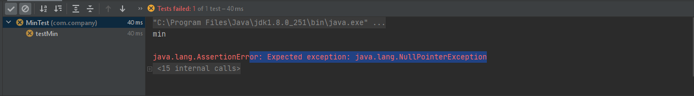

**Dưới đây là mã nguồn của tệp Min.java sau khi xoá phần xử lí lỗi ``NullPointerException``:**
```
package com.company;

import java.util.*;

public class Min
{
    public static <T extends Comparable<? super T>> T min (List<? extends T> list)
    {
        if (list.size() == 0)
        {
            throw new IllegalArgumentException ("Min.min");
        }

        Iterator<? extends T> itr = list.iterator();
        T result = itr.next();

        // if (result == null) throw new NullPointerException ("Min.min");

        while (itr.hasNext())
        {   // throws NPE, CCE as needed
            T comp = itr.next();
            if (comp.compareTo (result) < 0)
            {
                result = comp;
            }
        }
        return result;
    }
}
```
**Đây là tệp ``MinTest.java`` để viết ca kiểm thử cho tệp ``Min.java``:**
```
package com.company;

import java.util.ArrayList;
import java.util.List;
import org.junit.After;
import org.junit.AfterClass;
import org.junit.Before;
import org.junit.BeforeClass;
import org.junit.Test;
import static org.junit.Assert.*;

public class MinTest {
    @Test(expected = NullPointerException.class)
    public void testMin() {
        System.out.println("min");
        List list = new ArrayList();
        list.add(null);
        Object result = Min.min(list);
    }
}
```
**Chạy kiểm thử tự động ``Min.java`` và đã không qua được ca kiểm thử:**
