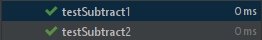
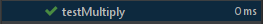
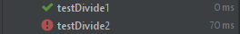
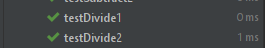

**Phương thức trừ hai số ```subtract (int a, int b)```:**
- Thiết kế ca kiểm thử: 
```java
public void testSubtract1() {
    int a = 9;
    int b = 6;
    int expResult = 3;
    int result = Calc.subtract(a, b);
    assertEquals(expResult, result);
}
public void testSubtract2() {
    int a = -6;
    int b = 9;
    int expResult = -15;
    int result = Calc.subtract(a, b);
    assertEquals(expResult, result);
}
```
- Thiết kế mã nguồn:
```java
static public int subtract (int a, int b){
    return a - b;
}
``` 
- Kết quả kiểm thử: (tất cả các ca kiểm thử đều thành công)


**Phương thức nhân hai số ```multiply (int a, int b)```:**
- Thiết kế ca kiểm thử: 
```java
public void testMultiply() {
    int a = 6;
    int b = 9;
    int expResult = 54;
    int result = Calc.multiply(a, b);
    assertEquals(expResult, result);
}
```
- Thiết kế mã nguồn:
```java
static public int multiply (int a, int b){
       return a * b;
}
``` 
- Kết quả kiểm thử: (tất cả các ca kiểm thử đều thành công)


**Phương thức chia hai số ```divide(int a, int b)```:**
- Thiết kế ca kiểm thử thứ nhất: 
```java
public void testDivide1() {
    int a = 10;
    int b = 2;
    double expResult = 5;
    double result = Calc.divide(a, b);
    assertEquals(expResult, result, 1);
}
```
- Thiết kế mã nguồn theo ca kiểm thử thứ nhất:
```java
static public double divide(int a, int b){
    return a / b;
}
``` 
- Kết quả kiểm thử lần thứ nhất:

- Thiết kế ca kiểm thử thứ hai: 
```java
@Test(expected = IllegalArgumentException.class)
public void testDivide2() {
    int a = 10;
    int b = 0;
    double result = Calc.divide(a, b);
}
```
- Kết quả kiểm thử lần thứ hai:

- Thiết kế lại mã nguồn:
```java
static public double divide(int a, int b){
    if(b == 0){
        throw new IllegalArgumentException("Không thể chia cho 0");
    }
    return a / b;
}
```
- Kết quả kiểm thử lần thứ ba: (tất cả các ca kiểm thử đều thành công, mã nguồn không cần phải cấu trúc lại (refactor) vì không có phần mã nguồn nào bị trùng)



