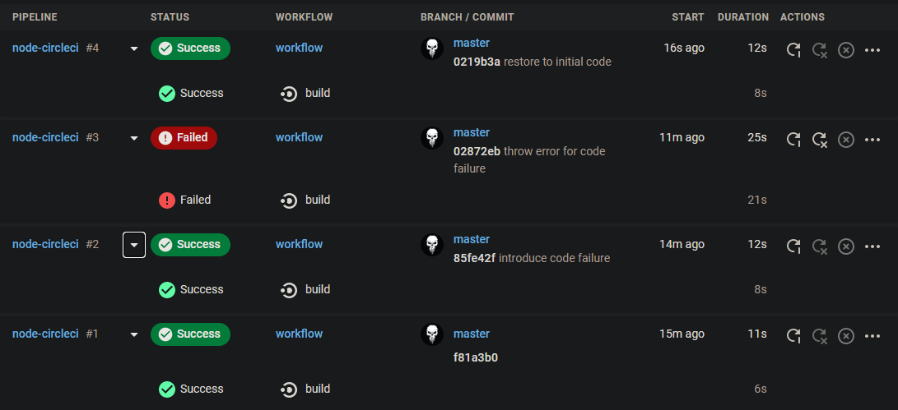
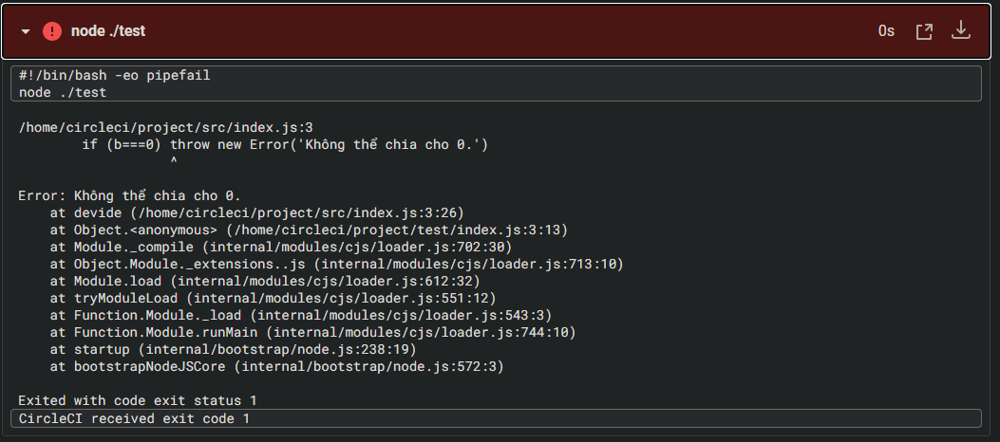

**Tạo dự án Github và cấu hình với CircleCI:**
- Github repository (là một chương trình tính phép chia số a cho số b): [node-circleci](https://github.com/tungnnt/node-circleci)
- Cấu hình ```config.yml```:
    ```yml
    version: 2.1
    orbs:
    node: circleci/node@1.1
    jobs:
    build:
        executor:
        name: node/default
        tag: '10.4'
        steps:
        - checkout
        - node/with-cache:
            steps:
                - run: npm install
        - run: node ./test
    ```

**Sau mỗi lần đẩy mã nguồn mới lên Github repository, Circle sẽ tự động khởi chạy lệnh ```node ./test``` trên mã nguồn mới:**


**Lí do lần đầy code thứ ba khiến ca kiểm thử thất bại:**


