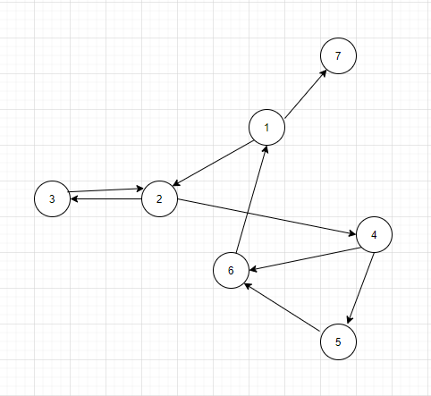

- Vẽ đồ thị:

- Liệt kê các yêu cầu kiểm thử cho bao hàm cặp cạnh:
    [``1``, ``2``, ``3``]
    [``1``, ``2``, ``4``]
    [``2``, ``3``, ``2``]
    [``2``, ``4``, ``5``]
    [``2``, ``4``, ``6``]
    [``3``, ``2``, ``3``]
    [``3``, ``2``, ``4``]
    [``4``, ``5``, ``6``]
    [``4``, ``6``, ``1``]
    [``5``, ``6``, ``1``]
    [``6``, ``1``, ``2``]
    [``6``, ``1``, ``7``]
- Đường đi kiểm thử cho sẵn không thỏa mãn bao hàm cặp cạnh vì chúng còn thiếu [``3``, ``2``, ``3``] và [``6``, ``1``, ``2``]
- Đường đi kiểm thử có đi vòng qua (tour) đường đi đơn giản: [``3``, ``2``, ``4``, ``6``, ``1``, ``2``, ``4``, ``5``, ``6``]
- Liệt kê yêu cầu kiểm thử cho bao hàm nút, bao hàm cạnh, bao hàm đường đi nguyên tố:
    + Bao hàm nút: **TR** = {``1``, ``2``, ``3``, ``4``, ``5``, ``6``, ``7``}
    + Bao hàm cạnh: **TR** = {(``1``, ``2``), (``1``, ``7``), (``2``, ``3``), (``2``, ``4``), (``3``, ``2``), (``4``, ``5``), (``4``, ``6``), (``5``, ``6``), (``6``, ``1``)}
    + Bao hàm đường đi nguyên tố: 
        [``1``, ``7``]
        [``2``, ``3``, ``2``]
        [``1``, ``2``, ``3``, ``2``]
        [``5``, ``6``, ``1``, ``7``]
        [``1``, ``2``, ``4``, ``6``, ``1``]
        [``2``, ``4``, ``6``, ``1``, ``7``]
        [``2``, `4`, ``6``, ``1``, `2`]
        [``1``, ``2``, ``4``, ``5``, ``6``, ``1``]
        [``2``, ``4``, ``5``, ``6``, ``1``, ``2``]
        [``2``, ``4``, ``5``, ``6``, ``1``, ``7``]
        [``5``, ``6``, ``1``, ``2``, ``4``, ``5``]  
- Liệt kê đường đi kiểm thử đạt được bao hàm nút nhưng không bao hàm cạnh: [``1``, ``2``, ``3``, ``2``, ``4``, ``5``, ``6``, ``1``, ``7``]
- Liệt kê đường đi kiểm thử đạt được bao hàm cạnh nhưng không bao hàm đường đi nguyên tố: [``1``, ``2``, ``3``, ``2``, ``4``, ``5``, ``6``, ``1``, ``2``, ``4``, ``6``, ``1``, ``7``]