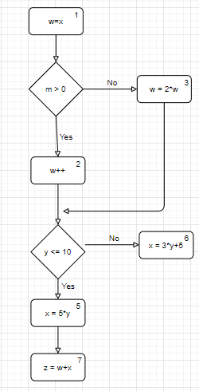

- Vẽ đồ thị: 

- Nút định nghĩa (def) biến ``w`` là: nút ``1``, ``2``, ``3``.
- Nút sử dụng (use) biến ``w`` là: nút ``2``, ``3``, ``7``.
- Không đường đi du-path nào mà liên quan đến biến ``w`` từ nút ``1`` đến nút ``7`` vì nút ``2`` và ``3`` chặn định nghĩa (def) ở nút ``1``. 
- Liệt kê mọi đường đi du-path cho tham số ``w`` và ``x``:
    + w: 
        [``1``, ``2``]
        [``1``, ``3``]
        [``2``, ``4``, ``5``, ``7``]
        [``2``, ``4``, ``6``, ``7``]
        [``3``, ``4``, ``5``, ``7``]
        [``3``, ``4``, ``6``, ``7``]