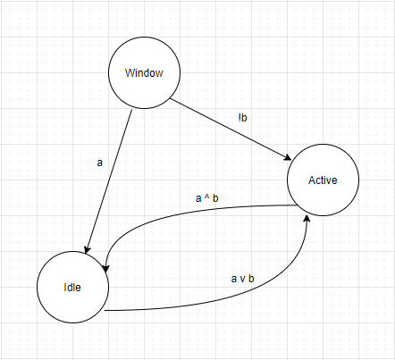

- Vẽ ra máy hữu hạn trạng thái

    
- Nêu ra điều kiện để mỗi trạng thái quay lại chính nó: 
    + Idle: ``!a ^ !b``
    + Active: ``!a ^ b``
    + WindDown: ``!a``
- Tìm kiểm thử CACC cho mỗi chuyển đổi từ trạng thái Active
    + Active -> Idle: ``a`` ^ ``b``, (``a``, ``b``) = (``T``,``F``), (``F``,``T``), (``T``,``F``)
    + Active -> Idle: !``b``, (``a``, ``b``) = (``x``, ``T``), (``x``, ``F``)
    + Active -> Active: !``a`` ^ ``b``, (``a``, ``b``) = (``F``, ``T``), (``T``, ``T``), (``F``, ``F``)