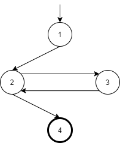

a. Đồ thị:

 
b. Không có đường dẫn kiểm thử đạt độ bao phủ nút nhưng không bao phủ cạnh. Tại vì tất cả đường kiểm thử phải bắt đầu từ 1, thăm nút 2, và cuối cùng kết thúc tại 4. Bất kì đường đi thăm nút 3 cũng thăm luôn cạnh (2, 3) và (3, 2).  
c. Đường kiểm thử đạt độ bao phủ cạnh nhưng không bao phủ cặp cạnh:
T = {[1, 2, 3, 2, 4]}.
d. Đường kiểm thử đạt độ bao phủ cạnh đôi:
T = {[1, 2, 4], [1, 2, 3, 2, 3, 2, 4]}.

