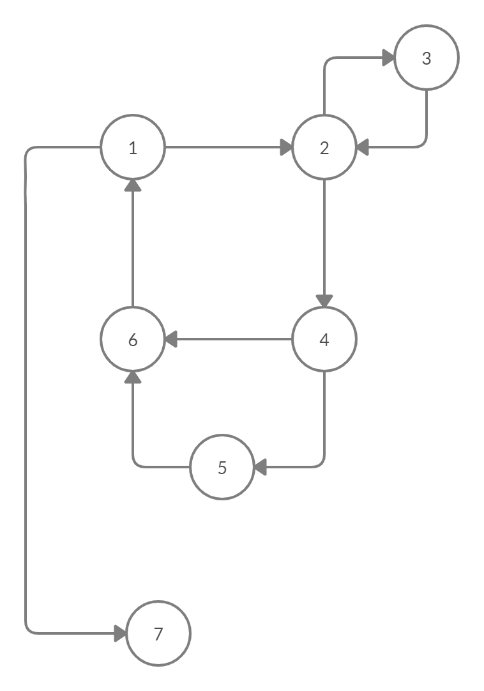

# Chapter 7.2.2-5.

## (a)

## (b)
Danh sách Edge-Pair Coverage:
(1,2,3), (1,2,4), (2,3,2), (2,4,5), (2,4,6), (3,2,3), (3,2,4), (4,5,6), (4,6,1), (5,6,1), (6,1,2), (6,1,7).

## (c)
Tất cả các test path đã cho không đáp ứng Edge-Pair Coverage vì đều thiếu (6,1,2).
## (d)
The test path does tour the simple path. The side trip is [4,6,1,2,4].

## (e)
#### Node Coverage TR:
(1), (2), (3), (4), (5), (6), (7)

#### Edge Coverage TR:
(1,2), (1,7), (2,3), (2,4), (3,2), (4,5), (4,6), (5,6), (6,1)

#### Prime Path TR:
(3,2,4,5,6,1,7), (2,4,5,6,1,2), (1,2,4,5,6,1), (3,2,4,6,1,7), (5,6,1,2,4,5), (6,1,2,4,5,6), (4,5,6,1,2,4), (4,5,6,1,2,3), (2,4,6,1,2), (1,2,4,6,1), (6,1,2,4,6), (4,6,1,2,3), (4,6,1,2,4), (3,2,3), (2,3,2)

## (f)
[1,2,3,2,4,5,6,1,7]

Đường dẫn trên thỏa mãn Node Coverage nhưng không đạt được độ phủ của Edge Coverage vì cạnh (4,6) không được bao.
## (g)
[1,2,3,2,4,5,6,1,7]
[1,2,4,6,1,7]

Các đường đẫn trên thỏa mãn Edge Coverage nhưng không thỏa mãn Prime Path Coverage.