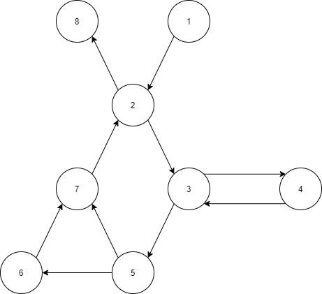
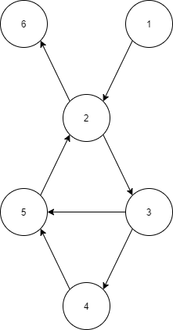

# Chapter 7.2.3-1.

## Graph I

### (a)

### (b)
Đường dẫn DU của đồ thị đã cho là : [1,2,8], [1,2,3,5,6], [4,3,5,6], [4,3,5,7,2,8], [4,3,5,6,7,2,8]

### (c)

t1 = [1,2,8]  
t2 = [1,2,3,5,7,2,8] 
t3 = [1,2,3,5,6,7,2,8] 
t4 = [1,2,3,4,3,5,7,2,8] 
t5 = [1,2,3,4,3,4,3,5,6,7,2,8] 
t6 = [1,2,3,4,3,5,7,2,3,5,6,7,2,8]

| Test path | DU-paths covered                          |
|-----------|-------------------------------------------|
| t1        | [1,2,8]                                   |
| t2        | [1,2,8]                                   |
| t3        | [1,2,8], [1,2,3,5,6]                      |
| t4        | [4,3,5,7,2,8]                             |
| t5        | [4,3,5,6], [4,3,5,6,7,2,8]                |
| t6        | [4,3,5,6], [4,3,5,7,2,8], [4,3,5,6,7,2,8] |

### (d)
{t3, t5} đủ để đảm bảo All-Defs Coverage.

### (e)
{t1, t3, t5} đủ để đảm bảo All-Uses Coverage.

### (f)
{t1,t3,t4,t5} đủ để đảm bảo All-Du-Paths Coverage.

## Graph II

### (a)

### (b)
DU-paths of given graph: [1,2,6], [1,2,3], [3,5,2,3], [3,5,2,6], [3,4,5,2,3], [3,4,5,2,6]

### (c)

t1 = [1,2,6] 
t2 = [1,2,3,4,5,2,3,5,2,6] 
t3 = [1,2,3,5,2,3,4,5,2,6] 
t4 = [1,2,3,5,2,6]

| Test path | DU-paths covered                          |
|-----------|-------------------------------------------|
| t1        | [1,2,6]                                   |
| t2        | [1,2,3], [3,4,5,2,3], [3,5,2,6]           |
| t3        | [1,2,3], [3,5,2,3], [3,4,5,2,6]           |
| t4        | [1,2,3], [3,5,2,6]                        |

### (d)
{t4} đủ để đảm bảo All-Defs Coverage.

### (e)
{t1,t2} đủ để đảm bảo All-Uses Coverage.

### (f)
{t1, t2, t3} đủ để đảm bảo All-Du-Paths Coverage.

## Graph III

### (a)
Đồ thị này về cơ bản giống như Đồ thị II nhưng với các cặp sử dụng xác định khác nhau.
### (b)
DU-paths of given graph: [1,2,6], [1,2,3], [1,2,3,5], [4,5], [4,5,2,3], [4,5,2,6] 

### (c)

t1 = [1,2,3,5,2,6] 
t2 = [1,2,3,4,5,2,6]

| Test path | DU-paths covered            |
|-----------|-----------------------------|
| t1        | [1,2,3], [1,2,3,5], [1,2,6] |
| t2        | [1,2,3], [4,5], [4,5,2,6]   |

### (d)
{t1} đủ để đảm bảo All-Defs Coverage.

### (e)
{t1, t2, [1,2,6], [1,2,3,4,5,2,3,5,2,6]} đủ để đảm bảo All-Uses coverage (Direct tour)

### (f)
{t1, t2, [1,2,6], [1,2,3,4,5,2,3,5,2,6]} đủ để đảm bảo All-DU-Paths Coverage

## Graph IV

### (a)
Đồ thị này về cơ bản giống như Đồ thị II nhưng với các cặp sử dụng xác định khác nhau.

### (b)
DU-paths of given graph: [1,2,6], [1,2,3,5], [1,2,3,4,5], [5,2,6], [5,2,3,5], [5,2,3,4,5]

### (c)

t1 = [1,2,6] 
t2 = [1,2,3,4,5,2,3,5,2,6] 
t3 = [1,2,3,5,2,3,4,5,2,6]  

| Test path | DU-paths covered                           |
|-----------|--------------------------------------------|
| t1        | [1,2,6]                                    |
| t2        | [1,2,3,4,5], [5,2,3,5], [5,2,6]            |
| t3        | [1,2,3,5], [5,2,3,4,5], [5,2,6]            |

### (d)
{t2} đủ để đảm bảo All-Defs coverage.

### (e)
{t1, t2} đủ để đảm bảo All-Uses Coverage.

### (f)
{t1, t2, t3} đủ để đảm bảo All-DU-Paths Coverage.