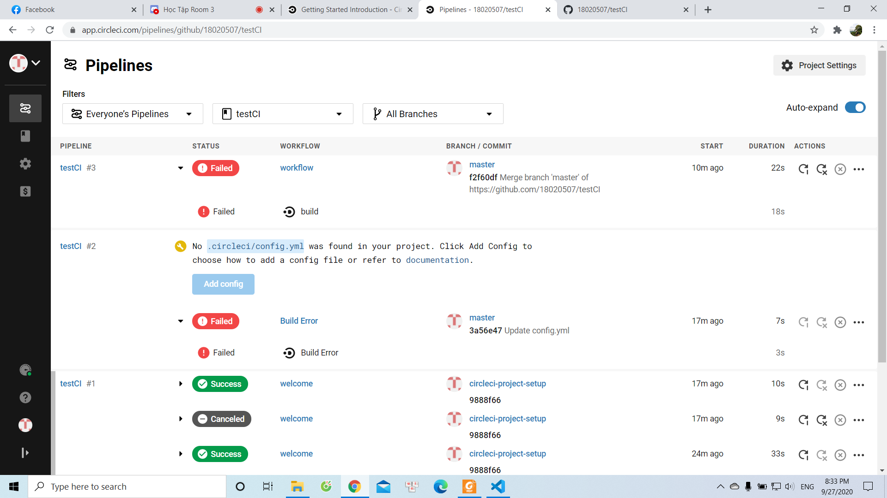

# Chapter 4-2

# Set up a continuous integration server. Include version control for both source code and tests, and populate both with a simple example. Experiment with “breaking the build,” by either introducing a fault into the source code or adding a failing test case. Restore the build.

- Ban đầu em tạo 1 repo rỗng tên là testCI và trong đó có 1 file README.
- Tiếp theo em chạy circle CI thì tất cả đều đúng (success).
- Tiếp đó em chỉnh sửa lại file config.yml để (breaking the build) thì 
khi chạy lại repo đó thì kết quả hiện là sai (failed).
- File ảnh chứng minh: 
