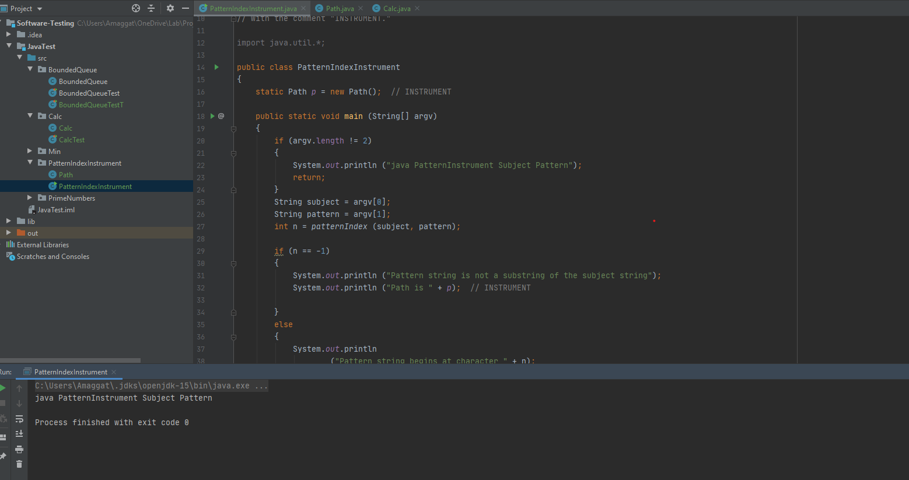

>Consider the pattern matching example in Figure 7.25. Instrument the
 code to produce the execution paths in the text for this example. That
 is, on a given test execution, your instrumented program should
 compute and print the corresponding test path. Run the instrumented
 program on the test cases listed at the end of Section 7.3

