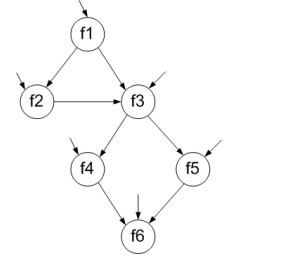

>Use the following program fragment for questions a–e below.\
>Use the following test inputs:
>- t1 = f1 (0, 0)
>- t2 = f1 (1, 1)
>- t3 = f1 (0, 1)
>- t4 = f1 (3, 2)
>- t5 = f1 (3, 4)
>
>(a) Draw the call graph for this program fragment.\
>(b) Give the path in the graph followed by each test.\
>(c) Find a minimal test set that achieves Node Coverage.\
>(d) Find a minimal test set that achieves Edge Coverage.\
>(e) Give the prime paths in the graph. Which prime path is not covered by any of the tests above?\
>

(a)\


(b)
- t<sub>1</sub>: [f1, f3, f5, f6]
- t<sub>2</sub>: [f1, f3, f4, f6]
- t<sub>3</sub>: [f1, f2]
- t<sub>4</sub>: [f1, f3, f4, f6]
- t<sub>5</sub>: [f1, f2, f3, f4, f6]

(c)
Ba khả năng: {t<sub>1</sub>, t<sub>2</sub>, t<sub>3</sub>}, {t<sub>1</sub>, t<sub>3</sub>, t<sub>4</sub>} 
hoặc {t<sub>1</sub>, t<sub>5</sub>}.

(d)
Một khả năng: {t<sub>1</sub>, t<sub>5</sub>}.

(e)
Có 4 prime paths: ```{[f1, f2, f3, f4, f6], [f1, f2, f3, f5, f6], [f1, f3, f4, f6], [f1, f3, f5, f6]}```. 
Đường thứ hai trong số các đường dẫn này không được bao phủ bởi các đường dẫn thử nghiệm đã cho.
