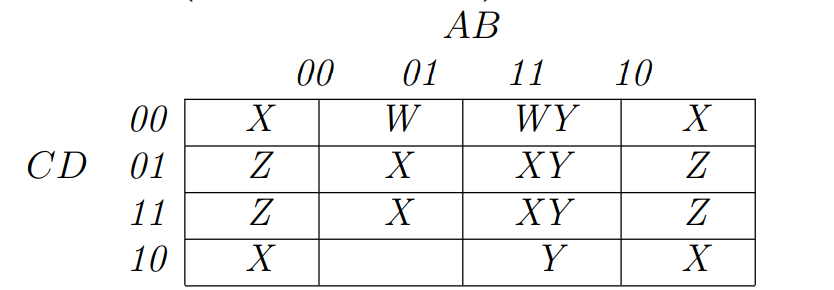

>Use the following predicates to answer questions (a) through (f).\
>- W = (b ∧ c ∧ d)
>- X = (b ∧ d) ∨ ( b d)
>- Y = (a ∧ b)
>- Z = ( b ∧ d)
>
> (a) Draw the Karnaugh map for the predicates. Put ab on the top
 and cd on the side. Label each cell with W, X, Y, and/or Z as
 appropriate.\
 (b) Find the minimal DNF expression that describes all cells that
 have more than one definition.\
 (c) Find the minimal DNF expression that describes all cells that
 have no definitions.\
 (d) Find the minimal DNF expression that describes X ∨ Z.\
 (e) Give a test set for X that uses each prime implicant once.\

(a)

(b)
AB¬C + ABD.

(c)
¬ABC¬D.

(d)
¬ B + D.

(e)
Hai ca kiểm thử là: {(FFFF, X),(FTFT, X)}.

