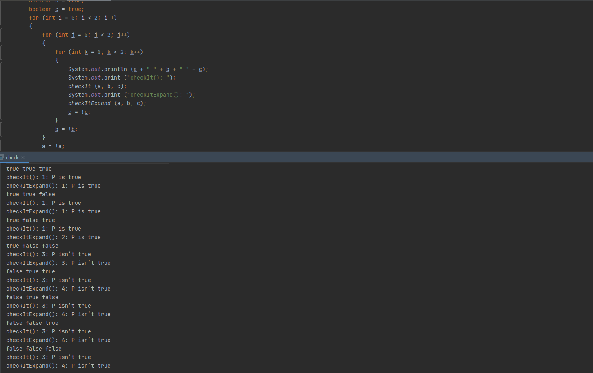

>Answer the following questions for the method checkIt() below:\
 (a) Transform checkIt() to checkItExpand(), a method
 where each if statement tests exactly one boolean variable.
 Instrument checkItExpand() to record which edges are
 traversed. (“print” statements are fine for this)\
 (b) Derive a GACC test set T1 for checkIt(). Derive an Edge
 Coverage test set T2 for checkItExpand(). Build T2 so
 that it does not satisfy GACC on the predicate in
 checkIt().\
>(c) Run both T1 and T2 on both checkIt() and checkItExpand().


(a)
```Java
public static void checkItExpand (boolean a, boolean b, boolean c)
{
    if (a) 
    {
        if (b)
        {
        System.out.println ("1: P is true");
        }

        else if (c)
        { // !b
            System.out.println ("2: P is true");
        }

        else
        { // !b and !c
            System.out.println ("3: P isn’t true");
        }
    }

    else
    { // !a
        System.out.println ("4: P isn’t true");
    }   
}
```

(b)
Nếu đánh số bảng chân trị theo cách thông thường, ta có:\
Cặp GACC cho mệnh đề a là: {1, 2, 3} × {5, 6, 7}.\
Cặp GACC cho mệnh đề b là: (2, 4).\
Cặp GACC cho mệnh đề c là: (3, 4).\
Vì vậy, tập kiểm tra GACC T1 cho ```checkIt()``` cần có các ca kiểm thử {2, 3, 4} (do các mệnh đề b và c) và một trong {5, 6, 7}.
Đối với bao phủ cạnh cho ```checkItExpand()```, chúng ta cần Txx và Fxx cho mệnh đề a, TFx và TTx cho mệnh đề b và TFT và TFF cho mệnh đề c. 
Hai hàng cuối cùng là hàng 3 và 4 từ bảng chân trị, vì vậy bất kỳ tập cạnh nào cũng phải có những hàng này. 
Ngoài ra, chúng ta cần 1 hoặc 2 cho TTx. Cuối cùng, chúng ta cần 5, 6, 7 hoặc 8 cho F xx.

(c)
