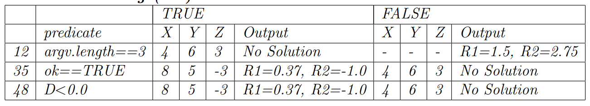

>For the Quadratic program in Chapter 6, complete the test sets for the following coverage
 criteria by filling in the “don’t care” values, ensuring reachability, and deriving the expected
 output. Download the program, compile it, and run it with your resulting test cases to verify
 correct outputs.\
 (a) Predicate Coverage (PC)\
 (b) Clause Coverage (CC)\
 (c) Combinatorial Coverage (CoC)\
 (d) Correlated Active Clause Coverage (CACC)\
>

Ta có PC:

Vì không có nhiều hơn một mệnh đề trong bất kỳ vị ngữ nào, 
nên PC bao hàm cả CC, CoC và CACC.