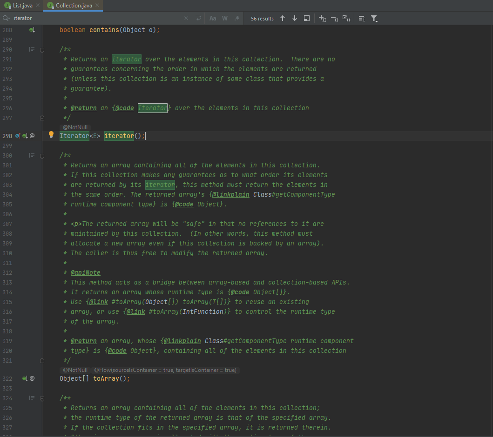

>Consider the remove() method from the Java Iterator
 interface. The remove() method has a complex precondition on the
 state of the Iterator, and the programmer can choose to detect
 violations of the precondition and report them as
 IllegalStateException.\
 (a) Formalize the precondition.\
 (b) Find (or write) an implementation of an Iterator. The Java
 Collection classes are a good place to search.\
 (c) Develop and run CACC tests on the implementation.

>

(a)
Cho chuỗi các lệnh gọi phương thức trên đối tượng trình lặp là c<sub>1</sub>, c<sub>2</sub>, ... c<sub>n</sub> trong đó mỗi c<sub>i</sub> là ```next()```, ```hasNext ()``` hoặc ```remove ()```. 
Điều kiện tiên quyết để c<sub>n</sub> là ```remove()``` là ∃i@c<sub>i</sub> = ```next()``` ∧ ∀j@i<j<n → c <sub>j</sub> != ```remove()```.

(b)


(c)
