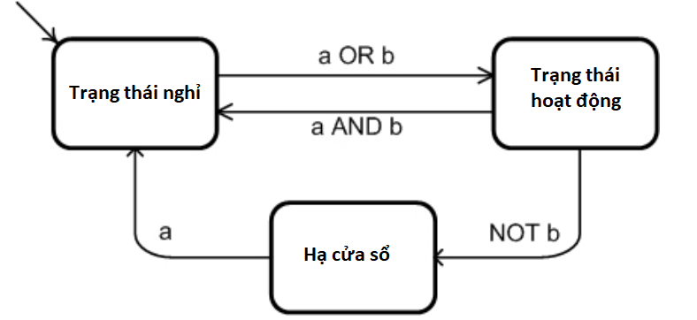

>Consider the following deterministic finite state machine:
>
>|Current State|Condition|Next State|
>|---|---|---|
>|Idle   |a ∨ b   |Active   |
>|Active   |a ∧ b   |Idle   |
>|Active   |b   |WindDown   |
>|WindDown|a|Idle|
>(a) Draw the finite state machine.\
 (b) This machine does not specify which conditions cause a state to
 transition back to itself. However, these conditions can be
 derived from the existing conditions. Derive the conditions
 under which each state will transition back to itself.\
 (c) Find CACC tests for each transition from the Active state
 (including the transition from Active to Active).

(a)

(b)

|Trạng thái hiện tại|Điều kiện |Trạng thái tiếp theo|
|---|---|---|
|Nghỉ |a ∨ b |Hoạt động|
|Nghỉ |¬a ∧ ¬b |Nghỉ|
|Hoạt động |a ∧ b |Nghỉ|
|Hoạt động |¬b |Hạ cửa sổ|
|Hoạt động |¬a ∧ b |Hoạt động|
|Hạ cửa sổ |a |Nghỉ|
|Hạ cửa sổ |¬a |Hạ cửa sổ|