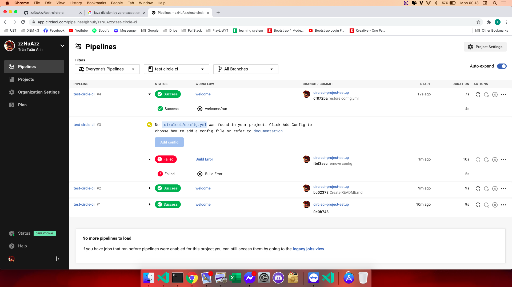

# Set up a continuous integration server. Include version control for both source code and tests, and populate both with a simple example. Experiment with “breaking the build,” by either introducing a fault into the source code or adding a failing test case. Restore the build.

- Bước 1: tạo một repo rỗng trên github và set up cirle CI:
  > Chạy circle CI: được kết quả thành công (success).
- Bước 2: thêm file `README.md`:
  > Circle CI: kết quả thành công (success).
- Bước 3: thử xóa tệp `config.yml` để làm lỗi (breaking the build):
  > Circle CI: hiện kết quả không thành công (failed).
- Phục hồi lại tệp `config.yml`:
  > Cirle CI: kết quả thành công (success).

<h2>Ảnh minh họa: </h2>

