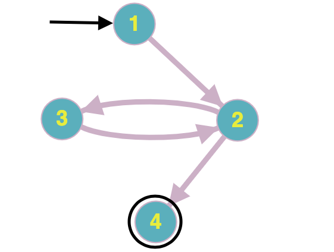

# Chapter7.2.2-4

**Answer questions a–d for the graph defined by the following sets:**  
`N = {1, 2, 3, 4}` 
`N0 = {1}`  
`Nf = {4}` 
`E = {(1, 2), (2, 3), (3, 2), (2, 4)}` 

`(a):` **Draw the graph:**

`(b):` **If possible, list test paths that achieve Node Coverage, but not Edge Coverage. If not possible, explain why not.**

Không có đường đi nào thỏa mãn đề bài. Mọi đường đi bắt đầu từ điểm 1 đều phải đi lần lượt qua tất cả các cạnh thì mới bao phủ được hết các đỉnh của đồ thị. Và khi đó nó cũng bao phủ hết tất cả các cạnh.

`(c):` **If possible, list test paths that achieve Edge Coverage, but not Edge-Pair Coverage. If not possible, explain why not.**

Đường đi kiểm thử mà thoả mãn tiêu chí bao phủ cạnh nhưng không thoả mãn tiêu chí bao phủ cặp cạnh là: 
`[1, 2, 3, 2, 4]`

`(d):` **List test paths that achieve Edge-Pair Coverage.**

Các đường đi bao phủ cặp cạnh là: 
`[1, 2, 4]`  
`[1, 2, 3, 2, 3, 2, 4]`
