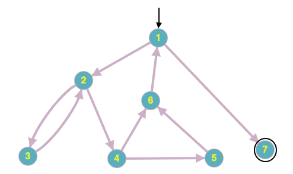

# Chapter7.2.2-5

**Answer questions a–g for the graph defined by the following sets: 
`N = {1, 2, 3, 4, 5, 6, 7}` 
`N0 = {1}` 
`Nf = {7}` 
`E = {(1, 2), (1, 7), (2, 3), (2, 4), (3, 2), (4, 5), (4, 6), (5, 6), (6, 1)}` 
Also consider the following (candidate) test paths: 
`p1 =[1, 2, 4, 5, 6, 1, 7]` 
`p2 =[1, 2, 3, 2, 4, 6, 1, 7]` 
`p3 =[1, 2, 3, 2, 4, 5, 6, 1, 7]`**

`(a)` **Draw the graph.**

`(b)` **List the test requirements for Edge-Pair Coverage. (Hint: You should get 12 requirements of length 2.)** 
Danh sách các cặp cạnh bao phủ:  
`[1,2,3], [1,2,4], [2,3,2], [2,4,5], [2,4,6], [3,2,3], [3,2,4], [4,5,6], [4,6,1], [5,6,1], [6,1,2], [6,1,7]`

`(c)` **Does the given set of test paths satisfy Edge-Pair Coverage? If not, state what is missing.** 
Các bộ đường đi đã cho không phù hợp với tiêu chí bao phủ cặp cạnh.

`(d)` **Consider the simple path `[3, 2, 4, 5, 6]` and test path `[1, 2, 3, 2,4, 6, 1, 2, 4, 5, 6, 1, 7]`. Does the test path tour the simple path directly? With a sidetrip? If so, write down the sidetrip.**

Đường đi kiểm tra không trực tiếp đi qua đường đi đơn giản. 
Tuy nhiên có đường đi phụ là `[4, 6, 2, 1, 4]`

`(e)` **List the test requirements for Node Coverage, Edge Coverage, and Prime Path Coverage on the graph.**

-   Bảo phủ đỉnh: `TR = {1,2,3,4,5,6,7}`
-   Bao phủ cạnh: `TR = {(1,2), (1,7), (2,3), (2,4), (3,2), (4,5), (4,6), (5,6), (6,1)}`

`(f)` **List test paths from the given set that achieve Node Coverage but not Edge Coverage on the graph.**

`{1,2,3,2,4,5,6,1,7}` không bao phủ `{4,6}`

`(g)` **List test paths from the given set that achieve Edge Coverage but not Prime Path Coverage on the graph.**

`{1,2,3,2,4,5,6,1,7}`  
`{1,2,4,6,1,7}`
