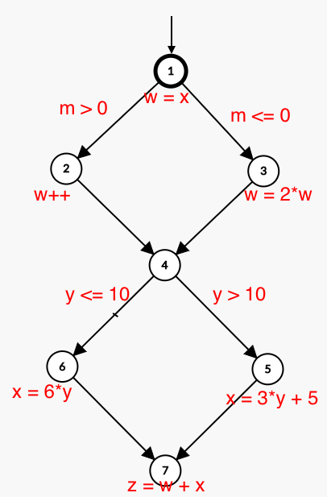

# Chapter7.3-1

## (a) Draw a control flow graph for this program fragment. Use the node numbers given above.

## (b) Which nodes have defs for variable w?

Đỉnh `1`, `2`, `3` gán giá trị cho biến `w`

## (c) Which nodes have uses for variable w?

Đỉnh `2`, `3`, `7` sử dụng biến `w`

## (d) Are there any du-paths with respect to variable w from node 1 to node 7? If not, explain why not. If any exist, show one.

Không có đường đi rõ tàng từ đỉnh 1 đến 7 đối với biến w

## (e) List all of the du-paths for variables w and x.

### Biến `w`
-   `[1,2]`
-   `[1,3]`
-   `[2,4,5,7]`
-   `[2,4,6,7]`
-   `[3,4,5,7]`
-   `[3,4,6,7]`

### Biến `x`

-   `[5,7]`
-   `[6,7]`
