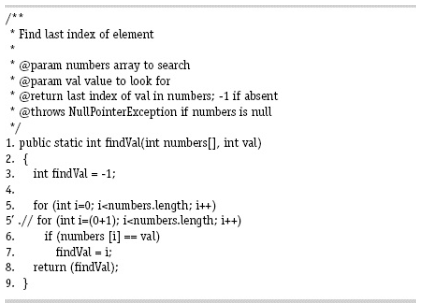

# Section 9.2-2

**Answer questions `(a)` through `(d)` for the mutant on line 5 in the method `findVal()`.**

`(a)` **If possible, find test inputs that do not reach the mutant.**

`findVal`: Đột biến luôn luôn đi qua.

`(b)` **If possible, find test inputs that satisfy reachability but not infection for the mutant.**

`findVal`: Lấy nhiễm luôn xảy ra nhưng `i` luôn bị sai giá trị sau khi khởi tạo vòng lặp.

`(c)` **If possible, find test inputs that satisfy infection, but not propagation for the mutant.**

Vòng lặp luôn bỏ qua `number[0]`, nên nếu giá trị đúng không ở vị trí đầu tiên thì vẫn sẽ trả về kết quả chính xác

`(d)` **If possible, find test inputs that strongly kill the mutants.**

Giá trị `val` nằm ở đầu tiên của mảng đầu vào thì sẽ triệt tiêu được đột biến đó.

`numbers = [1, 2, 3]`
 `val = 1`
