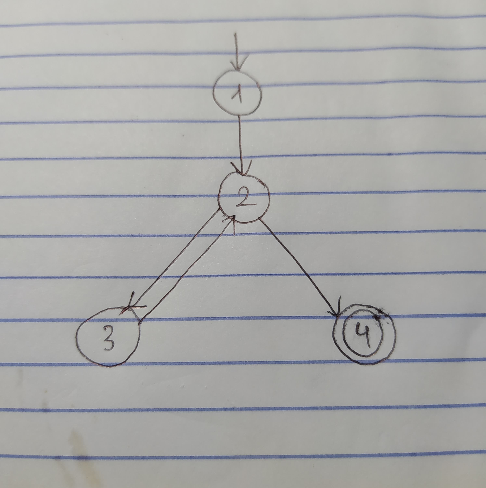

### N = {1, 2, 3, 4}
### N0 = {1}
### Nf = {4}
### E = {(1, 2), (2, 3), (3, 2), (2, 4)}

### (a) Draw the graph.

### (b) If possible, list test paths that achieve Node Coverage, but not Edge Coverage. If not possible, explain why not.
Không thể có trường hợp các đường kiểm thử thỏa mãn độ bao phủ theo điểm (node) mà không thỏa mãn độ bao phủ theo cạnh (edge) vì khi bao phủ hết các điểm thì nó cũng đã bao phủ các cạnh.

### (c) If possible, list test paths that achieve Edge Coverage, but not Edge-Pair Coverage. If not possible, explain why not.
Đường dẫn kiểm thử thoả mãn bao phủ theo cạnh nhưng không thoả mãn bao phủ cặp cạnh: [1, 2, 3, 2, 4].

### (d) List test paths that achieve Edge-Pair Coverage.
Các đường dẫn kiểm thử thoả mãn bao phủ theo cặp cạnh: [1, 2, 4], [1, 2, 3, 2, 3, 2, 4].

