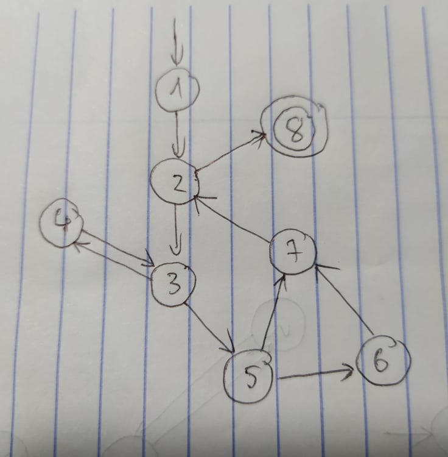

### Below are four graphs, each of which is defined by the sets of nodes, initial nodes, final nodes, edges, and defs and uses. Each graph also contains some test paths. Answer the following questions about each graph.

### (a) Draw the graph.

### (b) List all of the du-paths with respect to x. (Note: Include all dupaths, even those that are subpaths of some other du-path).
Các du-path liên quan đến x: [1,2,8], [1,2,3,5,6], [4,3,5,6], [4,3,5,7,2,8], [4,3,5,6,7,2,8]
### (c) Determine which du-paths each test path tours. Write them in a table with test paths in the first column and the du-paths they cover in the second column. For this part of the exercise, you should consider both direct touring and sidetrips
- Test 1: Tour: [1,2,8]
- Test 2: Sidetrip: [1,2,8]
- Test 3: Tour: [1,2,3,5,6]; Sidetrip: [1,2,8]
- Test 4: Tour: [4,3,5,7,2,8]
- Test 5: Tour: [4,3,5,6], [4,3,5,6,7,2,8]
- Test 6: Sidetrip: [4,3,5,6], [4,3,5,7,2,8], [4,3,5,6,7,2,8]

### (d) List a minimal test set that satisfies all defs coverage with respect to x. (Direct tours only.) If possible, use the given test paths. If not, provide additional test paths to satisfy the criterion.
Bộ kiểm thử tối giản thỏa mãn bao phủ toàn defs liên quan tới x: (t1,t4), (t1,t5), (t3,t4), (t3,t5).
### (e) List a minimal test set that satisfies all uses coverage with respect to x. (Direct tours only.) If possible, use the given test paths. If not, provide additional test paths to satisfy the criterion
Bộ kiểm thử tối giản thỏa mãn bao phủ toàn uses liên quan tới x: (t1,t3,t5).
### (f) List a minimal test set that satisfies all du-paths coverage with respect to x. (Direct tours only.) If possible, use the given test paths. If not, provide additional test paths to satisfy the criterion.
Bộ kiểm thử tối giản thỏa mãn bao phủ toàn du-path liên quan tới x: (t1,t3,t4,t5).
