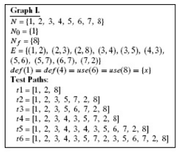

### Below are four graphs, each of which is defined by the sets of nodes, initial nodes, final nodes, edges, and defs and uses. Each graph also contains some test paths. Answer the following questions about each graph.

### (a) Draw the graph.
